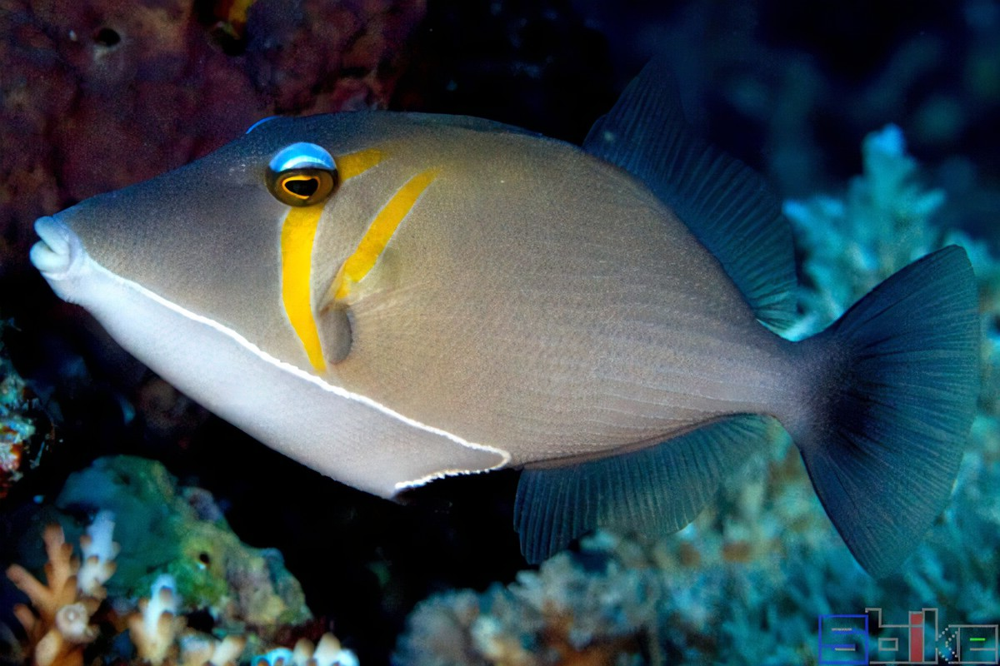

# 意外开始的旅行

阳光在波光粼粼的海面上闪烁，一叶孤舟在浩瀚的大海上孤零零地飘荡着。海风轻拂船帆，发出沙沙的微响，偶尔一两只海鸥掠过，发出清脆的鸣叫声。

两个少女正相拥着躺在甲板。

一阵咸咸的海风吹过，将垂落下来的船帆吹起一角，轻轻拂过一位少女的脸颊。

“唔……”

黑发的少女慢慢醒来，感受到刺目的阳光，举起手挡在眼前。

“头好痛……我在哪里……咦？”

逐渐适应光线的少女看清了周围——墨绿色，即使穷尽目力也无法看见一丝陆地踪迹的大海。

“……”

她的目光在大海与身边睡着正香的金发少女间流转几个来回。

然后……

“尤莉你这个笨蛋！快给我醒醒！”

------------------

“小千，好困……”

尤莉张大嘴，打了一个哈欠。

“现在不是睡觉的时候呀，我们怎么会出现在这里？！”

千户使劲摇晃着好像又要睡着的金发少女。

“小千不要摇啦，头好晕……还不是因为小千喝了那么多酒。”

喝酒……？千户愣在原地。

“嘿嘿，你不记得了吗，我们可把爷爷留下的酒全～部～都喝光了哦！”

“那、那还不是因为……”

小千忍着欲裂的头痛，想起了一点昨晚的事，一如既往只有杂音的电台，崩溃痛哭的自己，还有抱住自己的女孩。

“我们只有彼此了哦，小千。”

女孩这样说道。

然后这个家伙开始给自己灌什么东西，自己喝着喝着好像也忘记了哭泣，然后发生了什么就完全没有印象了。

好丢人。

------------------------------------------

“……当时我一打开地下室的门，哇，成排的架子上放了好多酒啊！明明以前也没怎么见过爷爷喝酒，结果竟然藏了那么多！”

千户愣神的功夫，尤莉还在兴高采烈的讲昨天发生的事。

“……小千也很厉害哦，明明一开始那么抗拒，后来一瓶一瓶的喝，都吓到我了！”

“不、不要再说这个了……拜托了。”

千户小手捂着脸，感觉脸已经要烧起来了。

……不对，要被这个家伙把话题带偏了。

“喝酒和我们出现在这里有什么关系！”

“哼哼，小千也要变成那种不认账的人了吗。
“昨天小千喝的像醉汉一样，突然把酒瓶一丢，拉着我到了仓库里，指着角落里积满灰的帆船对我说：‘我们要乘着它游遍四海！’”

“完全没有这样的记忆！”

“因为小千你喝醉了嘛。”

“再醉也不可能毫无准备就出海啊！”

----------------------------------

没有任何准备与计划，这不可能是自己会做的事，千户在心中很清楚这一点。

而在记忆的最深处，在千户也还没有想起的地方，女孩抱着酒瓶睡着前曾感受到的舒适怀抱，还有温柔的声音：

“但我们仍旧拥有彼此。”

## 说明:

### 船只

尤莉和千户乘坐的是一艘单体帆船，舰长9.3m，舰宽3.2m，吃水1.8m，在带船舱的帆船中算是比较小的类型。

帆船自带燃油动力，然而千户她们出发时没有加一滴油，所以也可以当成不存在了——但往好里想，她们至少不用纠结应该朝哪里开的问题。

虽然在外面看不出来，但船舱里的空间其实非常宽裕，就是那种足够两个人在里面一起打滚的程度，而且里面还藏了好几瓶好酒——但被小千发现后直接倒掉了，真是可惜。

# 清点与大鱼

- 十七袋压缩饼干（有巧克力味、香草味，竟然还有樱桃味），600g牛肉罐头
- 六罐饮用水（每一罐只有600ml）
- 一个不知多久没有使用的医疗包，里面有一瓶阿莫西林，一瓶晕船药，一瓶消毒水
- 已经没用的GPS信号接发器
- 看起来很可靠的指南针，六分仪
- 一套太阳能海水蒸馏器
- 一张太平洋海图
- 几个用处不明的酒精灯
- 一把钝头大刀
- 保存在刀鞘中，有被精心保养的伞刀
- 一个铁桶
- 一盒修补甲板用的铁钉
- 一根碳质的鱼竿
- 三捆钓鱼线

……

物资好少。

千户揉了揉眼睛。

她已经再三确认过这艘帆船没有任何控制手段，虽说有发动机，但燃油舱里空荡荡的，一滴油都找不到。木桨这种东西自然也是一个都没有，风帆只有提供动力的作用却无法控制航向，这样的话根本无法对抗洋流，回家的想法也成了奢望。

所以说，先前她们是怎么对抗近岸海浪（near shore wave），驶离港口的?

这样的话只能考虑如何在海上活下去了。

但物资太少了，根本无法支撑多久。

尤莉不在身边的此刻，千户轻轻叹了口气。

“小千……（咕噜咕噜）……快……看……”

听见尤莉的声音，千户赶紧离开船舱。

船板上没有人。

船舷一侧的海面突然激荡起层层浪花，隐约可见黄色的救生服在海中一会儿没入、一会儿冒出。一根绳索连在船头的铁环上。

“小……（咕噜）……我抓……”

千户顶着一幅死鱼眼看着尤莉，然后默默转身钻回船舱。

------------------------------------------------

“小千你看，我抓了好～大一只鱼。”

有尤莉一半个头的鱼正在船上翻跳，硕大的鱼头几成方形，黄绿色奇妙的分别占据身体上下两侧，并在中间渐变交汇。

一只丑丑的鲯鳅。

“有鱼吃，好开心……”

尤莉抱着抓上来的大鱼，一脸幸福。

大鱼使劲挣扎了几下，不动了。

“*****”

“唉唉唉，你说什么？”

“尤莉是个大笨蛋。”

“肯定不是这个啦。”

“……烤着吃吧。”

“好呀！”

---------------------------------------------------------------

尤莉抓到的鬼头鱼（鲯鳅别名）个头很大，只能切成小块，放在酒精灯上慢慢烤炙着。

不时翻面，鱼块上飘出诱人的香气。

“好烫好烫！”

待两面微微发焦，尤莉迫不及待的咬了一口，白色的热气骤然升腾。

虽然没有什么佐味品，但海鱼本身的咸鲜也非常爽口，两人边烤边吃。

阳光在鱼脂燃烧的噼啪声中逐渐偏过正午。

.

“我们才吃了这么一点，这条鱼肯定够我们吃好久！”

尤莉比划着已经被肢解剖腹的鱼上刚被她们砍去一块，大概只占全身三分之一大小。

“我们有两个人，这条鱼最多只能让我们吃到明天……否则后天时也要腐烂了。”

“唔……看来以后要再多抓一些才行。”

“而且以后也不一定能抓到这么大的鱼，我们总会有食物匮乏的一天。”

“那是因为小千在船舱里偷懒，没有去抓鱼吧。”

“我才不是在偷懒……”

千户想起还没清点完的物资，有些有气无力的回答。

“可是……只要我把小千丢下船，我抓的鱼就肯定能够我吃了。”

千户看着尤莉。少女湛蓝色的眼睛也在看着她，不像是在开玩笑。

“你……”

“但仔细一想，小千也是珍贵的储备粮食啊！”

“你竟然真敢这么想！”

千户突然把尤莉扑倒在地，跨坐在她身上，把尤莉的脸蛋往两边扯。

“好痛，嘿嘿。”

“你这个浑蛋！”

“窝戳了，好藤……”

一番打闹，感觉又饿了。

--------------------------------------------------

尤莉重新穿上晒在甲板上的救生衣。

“小千也要穿一件吗？如果船突然翻掉的话，我们就要靠这个了哦。”

“船沉的话我们有救生衣也没用吧，还是会死在这片大海上的。”

“但只要能活下去，哪怕仅仅只是一小会，也可以……唔……留住希望不是吗。”

希望吗。小千正在思考着，突然感到手上有一点凉意，抬起头。

雨点从天上落下，没有丝毫遮蔽的打在脸上、身上，隐隐发疼。

“小千小千，下雨了！”

尤莉身着臃肿的救生衣，在雨中跳来跳去。

雨不大，风也仅仅是将帆吹鼓的程度。

“尤莉，拿些容器，我们多接点雨水。”

.

(小剧场)

希望……那是什么呢。（小千在心里这样思考着。）

是烤鱼哦。（尤莉小声说道。）

你是从哪跑出来的啊，混蛋！（震怒之小千.jpg）

## 说明:

### 近岸浪

在海岸附近，由于不断抬升的海床大大减缓了海浪的传播速度，使得远海海浪的速度永远快于近海海浪，波峰间距随着与海岸的接近而愈发缩短，方向也逐渐与海岸垂直。

对于出海者而言，这意味着她面对的所有海浪都是将她推往海岸的，想要迅速远离近岸区域只能借助其他动力，比如发动机，或者风帆。

### 雨水收集

在收集雨水时可以将帆布或者塑料布摊开在甲板上，保持中间有凹陷，这样可以比单纯的用容器聚拢更多的雨水。

# 暴风雨

在漆黑中海浪一道接着一道，将下帆的小船抛上峰头，又狠狠摔在海面。

空中暴雨咆哮，粗大的闪电链⚡不时击穿雨幕，短暂照亮铅灰色的低垂云层与起伏剧烈如丘陵的海面，然后重重劈落在水面，分叉的电流如同逆生的大树般不断长出枝桠，并迅速向水中蔓伸。

此时，轰响的雷鸣才传入耳中。

尤莉紧紧抱着桅杆，凛冽的疾风把她的上衣狂野地吹鼓又塌下，像一只身陷风眼的小虫子般东摇西摆。暴雨来的太快了，虽然在风势加大时她们已经立刻降下风帆，避免了在第一波侧风中翻船的危险，但还是没来得及做更多准备。

“鱼飞走了……”

借着闪电的光芒，她看见涌来的海水淹没过船只甲板，像是泛着白沫的瀑布般在她身边冲刷而过，在退去时她们没有收起的鱼也一并不见了。

“真希望雨快点停下来啊……”

尤莉喃喃自语，声音却在出口时就被狂风吹散。

.

千户在船舱里滚来滚去，头撞到了一盒罐头。剧痛袭来，耳边是储物仓里杂物互相碰撞的叮当声响。

好疼。

每次海水涌入船舱，千户便以为她们的小船已经彻底沉没，但就在她绝望之时，海水又迅速涌出。大脑中只剩下一片翻滚的黑暗，鼻腔间充斥着腥咸的海水刺激，还有不知来自何处的撞击...恐惧在心头逐渐蔓延，她是否就要这样被海水永远吞噬?

“咳咳咳咳。”

千户猛烈地咳嗽起来，咸涩的海水哽在了气管，呛得她喘不过气。与此同时，她的意识也稍许回笼——尤莉，她必须去看看尤莉的情况!

她和尤莉刚把船帆降下，就迎面而来一道巨大的海浪，原本还只是存在于天际的波浪仿佛转瞬间便已近在咫尺，船尾被带动高高翘起像是要直接翻倒，千户被轻易抛入船舱，眼中所见的最后一幕是海水将甲板整个淹没。

尤莉现在在哪里，在刚才的风浪中她有没有抓住什么东西？否则的话，没有进入舱室的尤莉恐怕已经……

必须要出去看一看才行。

像是奇迹乍现，在她这样想的时候船突然平稳不少，如果不是依旧有雷鸣与骤雨敲打船舱的声音，仿佛这场风暴已经结束。

步伐轻浮的走出船舱，一道雷光闪过，她看到尤莉正抱着船桅，看到她出来了，便兴奋地招手，在感到安心的同时她也看到……

一道庞大到占据全部视野的黑色山脉！

不，没有山脉会运动，而那黑色的怪物却正缓慢而坚定的冲来！

她们的小船相比之下只是一粒微不足道的芝麻，正在两侧山脉间幽深的山谷中打转，那山谷太过光滑以至于仿佛平静的水面。

“尤莉……”

她转头看着自己唯一的好友，原本灿烂如阳光的金色长发此时正因淋水而湿漉漉的。

“＊＊＊＊”

尤莉似乎正喊着什么，但哪怕是这样近的距离她也什么都听不见。

“快回……！”

怪物将两位少女吞没。

----------------------------------------------------------------------

“尤莉，该起床了。”

“让我再睡一会嘛～”

“再不起来早饭就要被我吃光了哦。”

“嘿嘿～小千饭量那么小，才不会吃完呢～”

“已经吃光了。”

“哎？！”

帮软绵绵的尤莉穿衣服，把最后一件毛衫套好后，还没睡醒的少女抱住千户。

“小千，我刚才想到一个绝妙的主意哦。”

“……”

“只要你把早饭端到床上来，我就可以不用下床了！”

“不可以。”

“可是外面太冷了，一旦离开被窝，我一定会被冻死的！”

“冻成冰块的尤莉会不会安静一些呢……”

“小千笑得好可怕！”

尤莉被千户拉着手来到餐厅，餐桌前一个人都没有，只有千户早起做的三份煎蛋冒着热气。

“话说啊，原来爷爷也会睡懒觉的吗？”

“不是所有人都像尤莉这么懒的，爷爷一定是昨晚有事睡迟了。”

“小千好过分……”

“乖乖吃完西兰菜，我去叫爷爷。”

……

那是她们记忆里最后一顿平静的早餐。

.

冰冷，寂静，还有那彻骨的孤独。

这应该就是死亡了吧。

千户这样想着。

也没有太糟糕。

“小千。”

她想要睡去，但有人在喊她。

“小千，醒醒。”

好烦，我想睡觉了。

“现在还不能睡哦。”

不要再吵我了。

“再不起来，我就和小千一起睡了哦。”

……等等，那样的话谁来做早餐？

睁开眼睛，一双不同于海洋，浅蓝色的大眼睛正看着自己。

“尤，咳咳咳……”

想要说话，却被肺中的海水呛到。

像是在天上盘旋几圈后终于肯落地的客机，浑身的刺痛与海水带来的冰凉麻木此时突然涌入千户的大脑。

“小千，没事啦没事啦。”

尤莉一只手轻轻拍着千户的后背。

千户这才发现自己正被尤莉两只手抱着。

两人一起漂浮在无边的大海中。

船……沉了吗？

暴雨依旧没有停止，闪电仍在不时肆虐，波浪起起伏伏，但这次无边的大海中再也没有她们一寸栖身之处。

这才不是没事……

“尤莉，我们回不去了。”

腥咸的海风吹到湿漉漉的身上，千户下意识地收紧了双臂，将尤莉揽进怀里。曾经软绵的身躯如今硌手得像一块儿磐石。尤莉身上还穿着那件造型又丑又奇怪的救生服，但多亏了它，她们现在还没有步小船的后尘。

“小千，没事的，你看，我们还没有沉下去不是吗？”

“但我们恐怕也……”

……咦？

千户怔怔地看着她，随即眼睛骤然睁大。

“等等，你刚说了什么？”

“我说了什么……”

"没有沉下去！尤莉，我们没有和船一起沉入海底！"

"这是怎么..."

“你身上的救生衣，它连接着船！我们没被拖下水，说明船还在水面上！”

这样的话，只要顺着绳索游回船上就好了！

## 说明:

### 小袋帆

尤莉和千户在剧情中降下的是用于顺风航行的三角帆，这种风帆也称顺风帆，可以在合适的天气下提供非常强劲的推力。不过另一方面，在风雨交加的天气它会很容易造成小船侧翻。

最为典型的三角帆是大三角帆，在航行时鼓起的帆面足以覆盖整个受风面，鲜艳的帆面图案远处看过去就像一朵漂游在海中的小花。我们故事中这艘帆船上的三角帆属于小袋帆，只有单侧受风，体型也要小很多——不过也多亏如此尤莉和千户才能及时将它降下，真是可喜可贺。

### 疯狗浪

疯狗浪(rogue wave)是一种极为危险，同时出现前毫无征兆的巨浪，它的高度可以达到一般海浪的四倍，当一位航行者在海面上毫无准备的遇见这只超过20米的庞然巨兽时，他会发现自己渺小得如同一只快要溺死的甲虫。

关于疯狗浪的形成有两种比较主流的观点，第一种较为直观，当两个耸起的浪头正好相遇时，会短暂形成一个更为巨大的海浪，那么如果大量海浪以这种方式彼此重叠，就会形成疯狗浪；第二种则认为海浪之间并不是相互独立，相反，它们的能量会相互转换，而疯狗浪就产生在这种相互作用中。

# 鲸鱼🐳与星空

一只羽背漆黑，腹部却长着白色绒毛的剪嘴鸥在空中时就看到了海面上那个圆鼓鼓的怪东西，在盘旋几周确认没有危险后，它伸出脚，上下扇动着翅膀落在其表面，用细长的尖喙轻轻敲了敲。

那东西动了动。

剪嘴鸥轻柔的鸣叫一声，飞走了。

.

“鱼又跑走了。”

千户把头上的渔夫帽脱下来，揉了揉自己的头发。

满手盐粒。

海鸟飞来时千户已经很小心不要乱动了，但当它飞到帽子上时还是忍不住晃了晃。

原本好奇打量牛肉鱼饵的鱼儿飞快潜入水中。

“想吃鱼……”

尤莉躺在一旁，像一条晾晒中的咸鱼。

“现在还没有鱼哦，不过可以吃刚开的牛肉罐头。”

千户将牛肉粒在鱼线的一头重新固定好，然后把鱼线重新扔入水中。

一枚弯曲的铁钉将牛肉整个穿过，默默等待着某条克制不住自己的好奇心的小鱼。

“唔……小千，世界上最大的鱼有多大呀？”

"体型最大的话应该是鲸鱼🐳。"千户边答着，边留意着鱼线的摇晃，"不过严格说起来，鲸鱼并不属于鱼类。"

“咦，为什么呀？”

“它的祖先是肉鳍鱼，这种鱼中的一部分后来爬上了陆地，成为了两栖动物。”

尤莉睁大了眼睛:"是海洋嫌弃了它们吗?"

“你在说什么胡话啊……”

千户有些不满的看着空荡荡的鱼钩，刚才她看准一条炮弹鱼咬上了鱼钩，但当提起时发现已经跑掉了。

一同不见的还有作为诱饵的牛肉粒。

“当时的海洋环境不适合继续生存了，离开海洋是双方共同做出的选择。”

“太可惜了，我们不能在海里见到鲸鱼了……”

“鲸鱼就生活在海洋。”

“咦？！”

“大概5000万年前，鲸鱼的祖先，一部分已经在陆地生活了好久的偶蹄目生物重新回到了大海。”

“它们和好了！”

“差不多吧。”

“真想看一看鲸鱼啊。”

“尤莉一定在想，‘这么大的鱼能吃多久呢’。”

“嘿嘿。”

尤莉突然安静下来。她想象着千万年前，那些离开大海的生物重新回到熟悉的环境，汩汩的海水亲吻着它们的鳍肢...或许当时，所有的分歧和误会都已随时光冲刷得干干净净了。

“所以暂时消失的生物以后都会回来吗？”

“或许吧，但既然消失不见了，恐怕绝大多数都是灭绝了吧。”

“人类也是一样吗？”

“……不知道。”

“小千，你说如果消失的不是人类，而是之外的所有生物，那会怎么样？”

伴随海浪拍打在船舷，帆船节奏性地摇晃，千户一直没有回答，尤莉也没有再说话，好像睡着了。

.

醒来的时候，尤莉面前一片漆黑。

坐起身，脸上的东西掉落一旁，是千户的渔夫帽。

头顶是灿烂的星空。

没有乌云遮盖，也没有狰狞的风浪，满天星光在海浪间破碎成点点星芒。

千户站在船头，摆弄手中的仪器。

“小千在做什么？”

“今晚天气不错，我看看咱们大概在什么地方。”

“……在家？”

“不是。”

千户用六分仪上的望远镜对准水天线，调整指标臂直到南十字星座中的十字架二（α Cru）成像与水天线相切，然后在心中估算一番。

“我们没有天文历，所以只能估计一下，现在的纬度应该在南纬13度左右。”

“哦。”

“经度现在没有办法计算。”

“哦～”

“下午我钓上来一条鱼，给你留了一半。”

“哦！”

---------------------------------------------------------

南纬13度27分，距她们出发点相距1度24分。

.

(小剧场)

“这种计算之类的东西好麻烦。如果有东西能‘咻’的一下就把这些全部显示出来就好了。”

“那种东西也有，不过已经用不了了。”

“那么如果我们能看到什么奇奇怪怪的东西就好了，那样的话我们一定可以立即知道自己在哪里吧。”

“话虽如此，但一般的海岛我也未必能认得哦。”

## 说明:

### 钓鱼

为了避开阳光的直射，有些鱼类会躲藏在船底的阴影中，这使得船舰周围总是比其他水域更热闹些。

事实上，不久之后，这还会导致一些很有趣的现象。

### 六分仪

首先找到南十字星座中的十字架二（α Cru），这颗十字架中最亮的星星倒置在星座底部，距南极大约27°的方位。

使用指南针估计好子午线的方向，当十字架二正对着南极的子午线时，用六分仪测出十字架二与海平线间的角距，这个就是十字架二的天体真高度，再借助计算天文历消除十字架二南极间的角度差，得到的就是此时的纬度。

而经度的计算需要至少精准到时的格林威治时间，然后借助时差反推出经度，千户她们并没有这个条件。事实上，经度的测量即便在大航海时期也是一个难点，这或许也就无怪乎哥伦布错把美洲当成印度了。

# 航海日志

清晨，白色的小船上。

“尤莉，麻烦把装水的罐子拿过来。”

清晨的熹微在海平面上铺洒着朦胧的光芒，借着隐约的天光，千户用连接在船上的绳索把水滴形的蒸馏器拉到船侧，解下收集袋，里面是前一天蒸馏出的淡水。

尤莉眯着惺忪的睡眼，把一个空罐子捧了过来。千户接过罐子， 插入收集袋的吸管，慢慢挤压袋子。

透明的液体顺着吸管慢慢流入600ml容积的储水罐，然而到最后也没有装满。

“这点水也太少了吧。”

“往好里想，每天蒸馏一点水，几十天下来也有很大的总量了。”

千户一边说，一边准备给蒸馏器换一遍海水。

“所以说我们还要在海上呆多久啊。”

“我们现在基本在被东南信风和南赤道暖流推着往前走，如果一切顺利的话……大概六七十天就能到大洋洲群岛吧。但因为没法知道经度，所以我们中途突然偏航也不是没有可能。”

“好~远~啊，真想躺在家里吹空调，为了陪伴小千，我也付出了很多呢。”

“是是是……”

.

忙碌了一早上，终于在太阳升起前给蒸馏器重新换了一遍水。千户和尤莉围着咕噜咕噜烧水的酒精灯吃了一点晒干的鱼干，深褐色的条状物在几小时的晾晒后变得有些褶皱。

带点奇怪的甜味，但总体不难吃。

“这是什么呀？”

尤莉把鱼胃刨开，里面有坚韧的小碎片。

“塑料，应该是误食了漂浮的塑料垃圾。”

千户看了一眼，把最后一点鱼干扔进嘴里，又继续在纸上写写算算。

“总感觉最近这种东西越来越多了，也不知道海里哪来那么多塑料。”

尤莉一弹手指，看着小塑料片在空中跃出一个弧度，然后打着转落入海中。

“可能人们都是像你这样做的吧，以为大海是无穷无尽的，所以怎样扔垃圾都没关系。然后扔着扔着突然发现——哇，原来海洋已经脏成这样了，那么这是谁的责任呢？于是人们又为了推诿责任而争论不休。”

“我错了！”

“我代表地球母亲原谅你了。”

千户又翻了一页，看起来像在画图。

“好随意的原谅啊……话说小千，你从刚才开始就一直在写些什么呀？”

“航海日志。”

“那是什么，日记一样的东西吗。”

“差不多吧，要记录诸如每日天气，风吹动的方向，还有人员状态之类的东西，如果发生了什么重要事情的话也一定要写在上面。”

“写这个有什么用啊，反正也不会有人来看。”

“书本的作用，可不仅仅是记录哦。当文字经笔尖具象在书本，就像在和自己对话一样，杂乱的思序也会随之而清晰明了起来。”

“可我感觉不写出来，思维也很清晰啊。”

“因为尤莉的想法向来跟简单吧。”

-----------------------------------------

日志(第七日)

估算船位：南纬12度43分，经度未知。朝北的漂移速度远超预期，令人担忧。

中午十二点，风向西南微风3级。我和尤莉发现了大量的塑料漂浮物，有理由怀疑我们已靠近了"垃圾带"的边缘地带。根据估算，如果保持当前速度，我们或将在一周之内进入该区域的核心圈。

## 说明:

### 太阳能蒸馏器

蒸馏器是在大海上难得可靠的获得淡水的途径，其原理非常简单，利用阳光照射使得海水中的水分蒸发，并在顶部凝结成小液滴，然后利用水分子的张力使得液滴落入收集仪器。可以参见下图。这样一个蒸馏器每天大概可以转换500ml可饮用水，是每人每天建议饮水量的17.8%，最低健康标准的50%。

需要注意的是，使用时蒸馏器时需要确认海平面非常平静，否则海水可能在摇晃中污染蒸馏液。

### 鱼体内的塑料

鱼体内被检测出大量微塑料(microplastics，通常被定义为尺寸小于5mm的塑料碎片)，这已经不是新闻了，事实上今年荷兰的研究团队才发现，在他们招募的志愿者中有77%的人体内有“可量化”的微塑料，让人不由得想起了一句话：

“不管你测或不测，微塑料颗粒一直就在那里，只增不减。”

# 玩具

“罐头、塑料泡沫、水瓶、翻肚皮不能吃的鱼……还有一只鞋？”

尤莉把捞上来的鞋随手丢回去。

“都是没什么用的东西啊。”

“……如果还有用的话也不至于丢往海里吧。”

从几天前起,海面上的漂浮物日渐增多,它们漫无目的地漂荡、碰撞,如同无数只破旧的浮萍,将原本广阔辽远的大海变作了一座流动的垃圾场。船身不时撞上坚硬的塑料瓶或铝罐,发出"砰砰"的声响。而比垃圾更多的,是密密麻麻的鱼群正翻着雪白的肚皮漂浮在这片污浊的海域,偶有几尾狼狈不堪地撞上船舷,又在浊流的推挤下软绵绵地滚开。

这些鱼大多已经开始腐烂，空气中散播着若有若无的酸臭味。

“小千小千，我现在是偷牙齿的大老鼠！”

千户转过头，一只灰色的老鼠玩偶正对着自己，拟人化的脸上是一个灿烂的笑容，两颗门齿从嘴唇间露出，又为表情增添了一分滑稽。

“这是一只老鼠牙仙?”

“是啊，好像在和爷爷一起看过的电影里出现过。”

“所以，这就是叫玩具的东西吧。”

千户从尤莉手中接过玩偶，玩偶整体保存的很完好，就是一只眼睛已经脱落了，只留下一截线头露在眼眶外，已经被海水染成了黑色。

“尤莉，你上一次玩玩具是在什么时候。”

“打枪算吗。”

“我是说给小孩子玩的那种玩具。”

“可我小时候也只接触过枪啊，没有食物也没有住所，倒是枪和子弹触手可及，无论愿不愿意每天都要打好多好多枪，哪怕肩膀脱臼也不被允许停下。”

“……”

“之后就稀里糊涂的遇见了爷爷和小千，根本没机会玩玩具嘛。”

千户默默地摸了摸尤莉的头发，金黄色的发丝从指间流淌而过，柔软而又蓬松。

“所以说，玩具究竟应该怎么玩啊。”

“……或许可以和它说说话？”

“我才不要，好傻啊。”

在与小船航行相反的天际，太阳渐渐升入中天，灿烂的阳光蒸腾着大海，让海平面的空气因高温而微微扭曲。

尤莉和千户钻进了船舱。阳光追在她们身后， 在狭小的甬道里洒下一缕斜斜的光束，随着船身的颠簸时而明亮，时而黯淡下来。

千户手中还抱着半身高的玩偶，玩偶经过太阳的烘晒，已经干透了。

“其实像这种毛茸茸的材质，只是单纯的抱一抱感觉也很舒服呢。”

没有太阳的直射，船舱里凉爽不少，但玩偶身上还带着阳光的温度，让尤莉忍不住蹭了蹭。

“或许这就是它的用处呢。”

“小千在说什么啊？”

“既可以像人一样拥抱，也可以在没人倾诉时跟它聊天，玩具或许就是这样让人排解寂寞的东西。”

“咦，难道说我就是小千的玩偶吗！”

“一般没有玩具会像你这样吵吵闹闹的吧。”

“但我抱起来很舒服的哦，小千愿意的话随时都可以。”

“我还不如去抱这只大老鼠呢。”

牙仙(Perez)玩偶坐在旁边，头微微歪斜，孤零零的眼睛显得有些伤感，仿佛在怀念着某个温馨的场景——女孩(Lucas)在花园间欢笑嬉戏，抱着它仿佛拥抱着最好的朋友……如今那段快乐时光早已成为遥远的梦。

## 说明:

### 玩具

世人总是把玩具理解为带给孩子快乐的物件，可对于许多人来说，它们更像是一种情感慰藉、一个温暖的拥抱、一位能随时傾诉的知心朋友。当现实的人性关系失常，这种单向的亲密便成了排解内心空虚的最后一根稻草。毕竟谁都会在生命的某个时刻感到孤独，渴望有个温暖的存在能永久陪伴左右……

对作者而言，可能文字也是这样的东西吧。

### 海洋垃圾

海洋是一切生态循坏的必经之路，也不可避免地聚集了大量难以分解的垃圾，其中近半数是塑料制物，比如塑料瓶、泡沫塑料饭盒等等。除此之外渔业垃圾也占了很大的比重，比如渔网、缆绳等，鉴于工业社会前，不少渔户家中最重要的财产就是那张赖以为生的渔网，很难想象在丢失渔网后他们该如何继续生活。

和意外遗失的渔网类似，大海中也有不少非主观遗弃的垃圾。当货轮在海上遭遇暴风雨，集装箱可能因固定点松动而落入水中；甚至更糟糕的情况下整艘船都会沉没。这些被统一称为“海上损失”，可能就是我往国内发的明信片少有能收到的原因吧。

### 躲避太阳

在海上漂游时，应该避免自己过于疲惫，尤其是正午时，应当尽可能的休息以躲避阳光。这也可以减少水份流失。

# 文明的尸体

“小千，你有没有闻到一股特别恶心的味道？”

正午，炙热的太阳烘烤着海浪，微微扭曲的空气随蒸腾的水汽一起逐渐升温。

千户和尤莉正躲在船舱里讲海怪吃人的故事，故事里的海怪长着一张傻乎乎的圆脸。

一股惹人作呕的恶臭不知何时顺着阳光钻了进来。

“好像什么东西放坏了……尤莉你是不是把没吃完的鱼肉丢到甲板上了？”

千户嫌弃地捂上鼻子。

虽然自从进入垃圾富集带以来海水里总有股若有若无的酸臭味，但远远没有这么浓烈。

“我的那份鱼肯定都好好吃干净了，小千没吃完的那些我也帮忙吃完了哦。”

“我说吃了没几口的鱼怎么老是神秘消失！你这个偷鱼的小偷。”

千户一个手刀劈在尤莉头顶，尤莉“嘿嘿”的笑着，也不在意。

千户正准备说话时，船底突然碰到了什么东西，让小船整个晃动了一下。

“鲨、鲨鱼。”

千户摔倒在地，吓得面色苍白。

“鲨鱼是什么，能吃吗？”

“鲨鱼是一种专门吃其他鱼的鱼，要是在附近出现的话我们就危险了！”

“哦，那么小千的鱼也可能是被鲨鱼偷吃掉的哦。”

“现在不是说这个的时候！”

就在这时，小船又被撞的晃了晃，而且不止船底，就连船舱顶也出现了坚物敲击的清脆声音。

“小千，这又是什么？”

“听起来像是海鸟……这不太正常。”

千户一边说一边站起身。

“我出去看看，你先呆在里面吧。”

弯着腰从舱门口走出，很快消失在了灿烂的阳光中。

“小千也挺勇敢的嘛。”

尤莉小声说道，坐在地上看着千户离开的地方。

然而等了好久千户也没有回来。

“唔……”

跟着走出船舱，刺眼的阳光让尤莉一时无法适应。

睁开眼睛后，看见千户正站在船边发呆。

尤莉顺着千户的目光看去。

——忍不住屏住呼吸。

巨大的尸体静静地躺在水面上，浮出水面的部分相比整体只是冰山一角，但也像一座横亘在墨蓝海面上的小岛，铁青色的皮肤已经没有一丝光泽，上面还密密麻麻的攀附着一层藤壶，远远看上去就像不肯闭上的眼睛。

数十只海鸟盘旋在那具"岛屿"般的尸骸上空,熙攘嘈杂的扑击声不绝于耳。它们不时扑击而下，啄走一块腥红的肉块,很快又纷纷腾飞而去,只留下可怖的血渍和零星撕扯的肉沫。

这是一头死去的蓝鲸。

“小千，是我的幻觉吗？”

“……我也看见了。”

鲸鱼的尸体上横七竖八的缠绕着几张渔网，可能是用力挣扎的原因，彼此间缠绕愈加紧密，五颜六色的塑料袋挂在绳索上，随着海水涤洗而慢慢漂荡，像是某种巨物身上的寄生虫。

尤莉看到，还有几团塑料袋堵在鲸鱼的进气口里。

刺激性的臭味恍若实质般在空气中流动，如同腐烂奶酪般温热粘稠的触感将人包裹住，然后慢慢钻入皮肤，在皮下蠕动。

小千趴在另一侧船舷，开始干呕。

尤莉把千户扛在背上，往船舱走去，千户紧紧抓住船舷上的救生索，嘴里在说什么，但能听到的只有不成声的抽泣。

尤莉按住千户抓绳索的手臂，按压手腕内侧的麻筋，在手腕舒展的一瞬间将千户扔入船舱。

然后她转过头，面无表情的看着这具庞大的尸体。它立在那，沉重的像块无字的石碑。

“真是恶心。”

轻声说道。

---------------------------------------------

千户躺在船舱里，伴随着海浪的节奏，泪水止不住的往外涌出。

她不知道自己为什么这么难过，在这海上航行的14天里她们捕捉的鱼类早已有数十条之多，见过的鱼类尸体更是不计其数，但没有一条像今天这样带给她如此强烈的触动。

她今天见到了一只巨人，这巨人即便是尸体也如此雄伟，但也更映衬出死亡本身的悲哀。

它不该这样死去，丑陋而又毫无价值。

她想起了爷爷讲给她的故事，那时他们还不住在后来的住所，西海岸的战火仿佛永无止境，他们躲避着双方士兵，在夹隙间艰难生存。

“千户，生命是这片星空中最珍贵的东西。”

那天，他们在海边扎好帐篷，然后坐在石滩边，没有食物，也没有淡水，只有浩瀚无垠的天空与无尽的海面。

“这个宇宙间的多数事物，在它们诞生的那一刻起就在走向衰亡，它们的辉煌只有刹那，然后便是漫长的死亡期。”

“只有生命在宇宙的黑暗中逆行，由混沌走向秩序，由渺小走向伟大。”

“但这份前行并非没有代价。”

“在生命还在襁褓期时，他们需要火焰来抵御寒冷，而当生命踏上旅途，又需要火焰作为黑暗中的导引。”

“而火焰点燃于尸骸。”

“齐天的大树留下数以百计的果实，而当新生的大树开始蔓展枝桠，老树的遗骸早已焦黑一片。这并非悲哀，而是幸运。烧焦的灰烬会补充土壤的肥力，而破败的树穹不会再遮蔽新生命的阳光。”

“生命在咀嚼死亡中行进。”

然后爷爷给她讲鲸鱼的死亡，给她讲庞大洁白的鲸骨是如何成为海床上的绿洲，来来往往的鱼群在巨大的胫骨间游曳，为整片大洋带来盎然的生机。

那时的她没有注意到，爷爷讲这一切时目光从未离开过璀璨的星河，而她则一直在看卷起的海浪，肆意遐想深海中悠远的鲸鸣与壮美的鲸落。

但生命的死亡并非永远这么美好。

尤莉不知在船舱外做什么，感觉小船行驶的速度快了不少，海浪的起伏在这狭小的空间中愈加明显，千户蜷缩在地上，半睡半醒间，心里却一直有一个计时。

不知过了多久，在身后遥远的地方传来了闷闷的声音。

“噗。”

如果不注意的话一定会将这声音与海浪混淆，毕竟听起来是那么的微不足道。

就像一个气球被戳破，仅此而已。

.

当夕阳的余晖卷起天边的层层云朵，尤莉和千户在遥远的地平线上看见了一座小岛，被簇拥在无穷无尽的垃圾间，黑色的剪影显得有些不祥。

控制风帆令小船在垃圾间航行，驶入那座“小岛”天然形成的一处海湾。

尤莉一只脚试着踩了踩并非土壤质地的“陆地”，然后双脚踩实。

“小千，这里好奇怪啊，不像海岛……倒像是海面上的一层壳。”

千户把帆船拖到岸上，在与船接触的地方，有黑色的水渗出，在船上留下一个显眼的印记。

用棍子拨开地表浅浅一层泥土，下面是堆积缠绕的人工制品。

“曾经繁盛的渔业带给海洋数之不尽的渔网、鱼钩和绳索，而商品工业化则制造出不可分解的塑料与薄膜，这些曾经是促进人类发展的阶梯，但在无用后被随意废弃在海中。”

“人类很讨厌垃圾吗，明明制造垃圾的时候都那么热衷。”

“毕竟是没有用的东西，没有人会向它们投去视线。”

两人延着能通行的道路登上一处小山丘，放眼望去，已经结成硬壳的垃圾与在海面上自由飘荡的物品像是结为一体，一直蔓延至视野的尽头。

夕阳照在上面，不再像往日般宁静，而仿佛一抹血色。

“小千，这些都是人类制造的垃圾吗？好壮观……但是又好恶心。”

无穷无尽，遮蔽了海洋本身颜色的斑杂色彩。

如同被坏孩子打翻的颜料盒污染的一幅画。

“这些垃圾中的绝大多数都是最近二十年间产生的。人类的发展必不可少的会创造垃圾，并且越来越快，直到洋流的推动下在海中聚集成为新的‘大陆’。

“而这些垃圾在他们已经消失的现在也依旧存在，毒染经过的鱼类，成为海洋上一片难以愈合的疤痕。”

“……与其说是大陆，这里更像是一片坟墓啊。”

“嗯。”

为了发展，为了不驻足于当下，疯狂吮吸大地的血液，破坏一切即有的平衡，捕杀自己的领居直到尽数灭绝……然后在与自己的斗争中永远消失。

这就是人类这个种族最终的故事。

## 说明:

### 鲸爆

故事中，船舱中的千户听见了“噗”的一声，虽然没有明言，但这实际上是发生了名为"鲸爆"的可怖现象。鲸爆(Whale Explossion)具体是指大型鲸类尸体在陆地或海上由于死后体内残留的气体在高温下急剧膨胀,当体内压力积累到一定程度时就会在皮肤和肌肉组织最薄弱处破裂，造成剧烈的爆炸。爆炸时，腐烂发臭的碎肉和血液会像岩浆一样喷涌数米远，散发刺鼻的气味。那满目狰狞的爆裂场面，即便是构想也让人不寒而栗。

鲸鱼另一种名为"鲸落"的现象恐怕很多人都听说过，并惊叹于其凄美的意境。同样是鲸鱼，死亡却存在这两种截然不同的景象，让人不由得感叹自然的神奇。

### 垃圾大陆

在夏威夷到日本东海岸间一处巨大的海底洋流漩涡的影响下，人类向海洋中倾泄的无数不可降解的垃圾在此处汇聚，形成了一锅垃圾汤，向大海中倾泄着无穷无尽的毒素。

造成影响面积可达数个国家之大的污染海域。

尤莉和千户见到的这个其实并不是最大的垃圾岛，而是在赤道南部形成的规模较小的一个。

# 星光下的约定

沉默地离开垃圾形成的岛屿。

傍晚的日光落在粼粼的海面上，像是金红色的火花在浪尖翻滚，灿烂的绽放，又在转瞬间消逝。

随着日影西沉，焰光逐渐暗淡，海面归于深蓝与揉碎在其中的一点橘黄。

小船在色彩中驶过，留下一圈破碎的光彩，远远荡漾开来，然后融化在来临的夜幕中。

终于，那天边的巨兽不甘于就此平静的死去，向着天空最后一跃，为天际的铁青色的云朵披上了一层深紫色的霞光，然后终于落下，落入海中，不起一丝波澜。

像是要补全太阳留下的空位，无数的光点争相恐后地在天幕中浮现

在她们左手边的位置，那颗最为耀眼的一等星是南十字座中的十字架二，它遥遥指向的位置正是地理南极，为千户她们的导航提供了必不可少的作用。

在南十字座旁边的，是巨大的南船座，长长的船底斜斜插入海面，像是刚被一个浪头拍下，半截船身浸入水中的帆船; 船底座旁，是一条侧着身子刚飞出水面的飞鱼，黯淡的鱼身由6颗不超过3等的恒星组成，但在千户的角度看来，只有5颗孤零零的挂在天上。

再往西边看去，大犬座与小犬座在和麒麟座一起玩耍，而手拉手的双子站在太阳最终消逝的位置，仿佛在进行最后的穆哀。

点点的星芒在天上织出一条贯穿天宇的星河，灿烂的光辉在其中凝聚、交融。这些来自数十亿年前的光芒早已丢失了所有的温暖，却最终的给予了两位少女心灵上的宽慰。

在它们从各自的恒星出发时，地球还是一团没有凝固的高温气体，但当它们到来时，曾经璀璨的人类文明已经只剩遍地废墟，这些姗姗来迟的旅客再也见不到那些人类创造的奇景——当晨昏线划过地表，陷入黑暗的大地上亮起此起彼伏的辉光，那是城市的灯光在与夜幕抗衡，足以照亮云彩的灯火在大地上连成一片繁复的光网。如果数十万年后，一位数十万光年外的观星者将自己的望远镜指向一颗猎户座内旋臂上的黄矮星，它会惊讶的发现黄矮星旁一颗小小的伴星在过去数百年间亮度不降反增，近乎执拗地向所有观测者宣告自己的存在。

那点点的灯火虽不及群星长久，但也是人类曾经存在的证明。

“尤莉，我有一件想完成的事情。”

而现在，可能是最后人类的两位少女正在开始一场漫长的旅途。

“我想去看一看这个没有人类的世界。”

这场旅途会跨越所有人类核心聚集区。

“我想知道他们创造过的奇迹，我也想去了解他们对自己与自然犯下的罪行……”

见证人类的骄傲与悔恨，见证他们未曾说出口的那句遗言。

当那场源于东非的灾难席卷全球，当潘多拉的魔盒在理性的劝阻下仍被感性的冲动开启。

“我想知道他们为什么伟大，我想知道他们为何会灭亡，我还想要去寻找其他可能存活的人类，问一问他们眼中的人类是什么样的……”

人类一直在寻找自己的归宿，但知晓答案的那一刻却就是一切的终结。

他们是怎样想的呢？

“尤莉，你愿意陪我一起吗？”

“小千在说什么奇怪的话，我们当然会在一起。”

“这件事可能会做很久很久，久到会让我们厌烦。”

“反正小千一定会先放弃的，到那时我就把你扛着走。”

“而且过程一定会非常危险！没有食物和水的情况将经常出现。”

“要不然你以为我为什么要扛着小千走啊。”

“尤莉你这个大混蛋！”

星光下，两位少女在终末世界中的旅行，正式开始。

## 说明:

### 南半球的星座

(占位)

### 文明灯火值

(占位)

# 静止的世界

“小千，这个东西是死掉了吗？”

尤莉戳了戳风帆，它正无精打采的垂落在桅杆上。

过往连着几天阴雨连绵，虽然提供了不少淡水，但也让她们的航行速度减慢了不收少，好不容易有一天晴空万里，想升起帆来多航行些路。

但好不容易升起的帆只是挂在架子上，半点不见鼓起。

千户将手指含在口中，然后举在空中感受了一会。

“真的……一点风都没有呢。

“而且最近的天气也有点奇怪，一会是天晴，一会又是下雨，反反复复的就像一个吵闹的小女孩。”

“吵吵闹闹的小女孩是谁啊？”

“……”

千户看着波纹微弱的海面，缄默不语。

“小千，发生什么事了吗？”

“尤莉。”

“嗯。”

“我们好像迷路了。”

--------------------------------------------------------

一般人心中的海洋是什么样子？

墨绿色的海面，随着水面下的洋流不断起伏，不时有相互独立的波浪叠加出一个更大的波峰，两三米高的海波高高扬起，仿佛一只伸向天空的鱼鳍，然后砸落水面，溅出一朵晶莹的水花，在阳光下映射出一道短暂的彩虹。

在海面上必不可少的还有海风，咸湿的气流在水面上流淌，如同另一条无形的河流，当有甲板上的海员向它敞开拥抱，它便会无私地赠与来自远方的信息——那往往是死亡的信息。死去的鱼类、漂浮的海藻，还有裹满海盐的人类造物，它们浮在海面上，露出水面的部分被太阳的持续炙烤，而水面下的部分还要受到水体形成的透镜影响，在高温潮湿的环境下腐败发生的如此迅疾，以至于在食腐者还在赶来的路上时，有机物被微生物降解所诞生的氨气、硫化氢气体就已盈满水面，然后顺着海风吹散四方。

如果你对海洋是这样认知的，那么赤道无风带的存在就是对认知的恐怖颠覆。

上午10点41分，尤莉正在打量风帆的时刻。

天空中没有几朵云彩，但在这远离人烟的地方也没有呈现出高原地区一般，近乎于透亮的宝石蓝色，而是更加浅淡的水蓝色，少有的云彩稀疏的排布在天空，一直延伸到水天交界的地方，然后跨越边界线，直接点缀在浅蓝色的海面。此时的海水一改往昔神秘的深沉，变得清亮而明净，不受水平风影响的海面平整的如同倒悬的天空。

小小的帆船漂在水面，几乎一动也不动，远远望去，就像正飘浮在无尽的天空中，海与天与船与船上的两个小人，一同构成了一幅静止的画面。

-----------------------------------

“船舶动力的发展是一个非常漫长曲折的过程，但总体来说可以分成六个阶段，分别是无动力、人力、风力、外燃机动力、内燃机动力、电力(核)动力。

“最原始的无动力船舶类似于木筏或者救生筏，在水上完全没有任何控制能力，只能随波逐流，使用场景也多在内陆河流，至于出海，大概率连近岸波都无法对抗；人力倒是解决了控制问题，不但不依靠外界力量，而且可以通过增加人数的方式简单的加大动力，但人力的问题也很明显，人类本身体力有限，做功也实在算不上强，短期航行还好，但长期旅行的话也相当于无动力了。”

船舱里，千户不知为何突然讲起了船舶的动力，尤莉在旁边听得昏昏欲睡。

“真正解决远距离动力问题的是风动力，随着风帆的出现，人类开始使用大海上无处不在的风，只要合理的控制风帆的收放与朝向，确保船舶能够搭乘上大海中的高速路——洋流，但这种动力的缺点同样致命，如果陷入一个没有风与洋流的地域，那么整艘船上的人都只能坐以待毙。

“而这样的地方在大海上就有几处，我们现在所处的正是其中之一，赤道无风带。”

千户正要继续说下去，尤莉却突然举起手。

“千户老师，我有一个问题！”

“尤莉同学，请说。”

“这部分内容平时不是应该放在每章最后吗，放在正文里的话也太枯燥了。”

“笨、笨蛋！你这样说会打破第四面墙的！”

(“话说小千，你之前说我们迷路了……难道说之前我们一直都在路上吗？”)

(“那只是个比喻……”)

## 说明:

### 赤道无风带(一)

(等等，这里的内容呢？)

# 一个人的旅途(上)

“今早，一只鸟停靠在船头，我想抚摸它，它灵敏的躲开了。

我对它没有恶意，但它可能看见了那些被我藏在阴影处的骨头。

上面还有我细密的齿痕。

我不想这样做，但我必须活下去。

这是我一个人漂流的第28天。”

.

“这几天我经常在想，自己为什么要写这份日志，是为了记录什么吗，还是为了寻找一个诉说的对象？

我想了好久，发现自己只是无聊而已。

当爸爸妈妈还在的时候，我每天都在读书，因为我不知道做什么事情可以躲避他们无休止的争吵；当爷爷收养我时，我每天依旧在读书，因为没有什么事情是我能做的。

你曾经问我为什么这么喜欢读书，我真的喜欢吗？

但除此以外，我还能做什么呢。”

.

“第31天，晴，小风。

今天，我第一次尝试捕鱼，但船上太过于颠簸，我还没有把鱼叉扔出去，自己先摔倒了，头撞了一个大包，好疼。

船周围围绕着好多鲯鳅，它们的眼睛凶巴巴的，镶嵌在又大又圆的脑袋上，看起来像是一个球鼻艏；它们身上蓝绿色的色泽在水下波纹的映照下闪闪发光，让我时不时看入了迷。

不过我还没有忘记自己该做什么，我蹲在船上，瞄准一只静止的鲯鳅，用力扔出鱼叉，水面掀起一阵水花，我知道这是它的尾巴在疯狂扇动。我射中它了吗？

并没有，漂亮而强健的尾巴朝下有力摆动，几只鲯鳅跃出水面，在空中划出一道优美的圆弧，像是海洋里的精灵在跳舞，然后落入水面时，水花溅了我一脸。

我有点生气，下次一定会抓住它们。”

.

“早上迷迷糊糊醒来时，感觉手指被什么东西紧紧的裹住，软软的，湿湿的，我睁开眼睛，一只大鲯鳅朝我甩了甩尾巴，我的一根手指正叼在它的嘴里。

我急忙抽回手，发现没什么事才松了口气。

昨天晚上船舱里太闷热了，我坐在甲板上睡觉时可能不小心把手垂在水里，幸亏没有被鱼咬一口。

白天，我注意到船下又多了一种新的小鱼，它们身上的色彩很漂亮，棕色的表皮上点缀着点点白色，长长的尾鳍末端是鲜艳的黄色，好像刚从树上摘下的柠檬，它们嘴角有一处各不相同的斑纹，看起来像是扁平着嘴，闷闷不乐的样子。

从体型上来看，它们是鲯鳅的理想猎物，我不由得为它们担心起来。

这些鱼群聚集在这里，可能是为了靠我的三明治号来遮凉，也可能是为了吃船下附着的甲壳生物，不过无论如何我都欢迎它们。

这不仅是因为我会因此有更大的机率捕到鱼，还因为它们的到来为我漫长而无趣的旅途添加了一点慰藉。

至少我不再是一个人了。

.

“第33日，阴。

刚才我抓住了一条鲯鳅，但完全是因为运气。

原本我只想抓两条小鱼——我没猜错的话它应该是炮弹鱼。我在鱼钩上挂了一点饼干，试试看能不能引诱到一只贪嘴的鱼儿，然而饼干很快就在海水中被泡软了，在我思考该用什么做诱饵时，突然发现那些小鱼竟然会对闪闪发光的鱼钩更感兴趣。

我立刻改变了我的策略，开始用不挂任何东西的鱼钩直接钓鱼。

没多久我就钓到了一次炮弹鱼，它的身体不大，但却异常有劲，即便被扔在船上还弹跳了好久。我没有立刻处理鱼肉，而是决定一股作劲再钓一条。

我让鱼钩在水里微微摇晃，那反射的光芒就像有珍宝在水下闪烁，一只炮弹鱼很快就被吸引住了，它围绕着鱼钩转了两圈，最终还是扑了上去。

这个时候我已经准备好迎接我的第二条渔获，但不想此时水面下波纹一卷，一只鲯鳅突然从深水中钻出，一口吞下了小巧的炮弹鱼，然后顺便咬住了我的鱼钩。

我预料到鲯鳅的力气会很大，但没有想到小船竟然都会被它拉动，我感觉自己就像海明威笔下的圣地亚哥，在和一只令人望而生畏的大鱼作搏斗。但幸运的是我并没有耗去两天两夜的时间，体长不过40厘米的鲯鳅终究没有多少力气。

直到傍晚我才把一大一小两条鱼处理好，它们浑身上下对我来说都是极为宝贵的财富，鱼眼和脊椎骨中含有珍贵的淡水，鱼皮下厚厚的一层脂肪可以补给我大量的卡路里，内脏中的维生素我在其他地方很难获取，而鱼肉中的蛋白质更是恢复伤势必不可少的材料。

我把所有鱼肉都切成了窄窄的长条，铺在甲板上让它们烘干，在忙完后我尝了两条，味道咸中稍微带点辣味，好吃极了。”

.

“第37日，晴，日晒强烈。

一只鲯鳅提供的肉质可以让我吃三天，这几天我又多捉了几条用作储备粮。

它们很聪明，许多我用过的伎俩第二次使用时它们就不再会上当，有时我会感觉自己在和它们玩捉迷藏，每次当我拿起鱼叉，就仿佛在向它们大喊：请小心，我要开始抓鱼了。它们便会开始各显神通的躲避我，但也不会一下躲很远，让游戏无法进行，而是在一个不远不近的地方打量着我。

但当我开始处理血肉淋漓的尸体时我又不得不正视：没有捉迷藏中会有人永远当鬼，也没有一场游戏应该让失败者付出如此惨痛的代价。

我是捕食者，它们是被捕食者，我们都是自然循环中渺小的一部分。

你们原意原谅我吗？

有时我会坐在船边，低声向它们道歉，但它们现在相比以前很少会浮出水面，浮现的位置也离船远了许多，我不知道它们能不能听见我的话。

但是即便能听见，它们真的会原谅一名残杀同胞的刽子手吗。”

.

“我生病了，刚才把昨天吃掉的鱼肉全部吐了出来。

身上很难受，损失的水份化为干燥的饥渴紧紧缠绕在内心，我躺在甲板上，感觉大脑和肠胃绞在一起痉挛。

我强迫自己去看天空。

天空很蓝，几团云朵时聚时散，像是在玩游戏，这让我想起了海中的鱼儿。

我坐起来，将一只手伸入海水中，水面上什么也没有。

我好难受，你们愿意陪陪我吗。

我向它们呼唤，声音轻的连我自己都听不到，但我真的很想见它们，很想看见它们灵巧的身姿在水中游动。

我闭着眼睛，在心中一遍又一遍的呼唤，然后手中有了一个柔软的触感。

是鲯鳅。

我轻轻转动手指，冰凉滑腻的鳞片从我指间划过，它们也不躲闪，反而将身体进一步贴近我的手臂，但如果我想得寸进尺的抓住它们，它们就会害羞似地跑开。

就这样和它们玩了一会，不知为何，我感觉好了很多。”

.

“今天早上我又一次呼唤它们，想继续昨天的游戏，但我等了好久它们也没有出现。

从早上到中午，然后到下午，我没有在水面上看见一个熟悉的鱼头探出水面来换气。

它们走了。我突然意识到昨天与我的亲近是在和我道别。

在疼痛时我没有落下一滴眼泪，但这时我突然哭了。

我用手捂住眼睛，我知道自己不能这么浪费难得的淡水，但泪水就是不受控的往外冒。

我好孤独。”

.

“第43天。

海水蒸馏器上破了一个洞，但我没有注意就把收集器里的水倒入储水箱。

我的4升净水因此被污染了。

我尝了一下，是苦味的。

我还以为会更像泪水。”

.

“刚才我找遍了所有的储水容器，但没有找到哪怕一点水。

我的淡水消耗光了。

几天前当我弄破蒸馏器时，我相信自己会很快解决这个问题，但我这几天唯一做的事情就是坐在船舱里发呆。我在等待什么呢，这片无边的大海上，还有谁会帮助我吗。

人类已经不在了，你也不在了。

只剩下我一个人。”

.

“49天。

今天我在船上半睡半醒时，听到了船底与什么东西撞击的声音，我恍惚了一会，然后欣喜若狂，我想三明治号一定是被海水推上了岸。但我离开船舱时并没有看见银白的沙滩与成片的棕榈树，大海母亲依旧紧紧束缚着我。

撞击小船的是一只迷途的海龟。

可怜的小家伙，它一定把这条没有动力的漂浮物当成了一个落脚点。我把它抱上船，给了它一些晒干的鱼肉，我已经好几天没有吃这些鱼肉了，在没有充足水份的情况下摄入蛋白质只会加速我的脱水症状。

海龟没有吃我给它的食物，它只是迷惑地看着我，眼帘像是没睡醒一样半耷拉着，我摸了摸它的爪子，它没有躲开。

我兴奋了一整天，就连口渴与饥饿都不再难熬，我又一次有了可以交流的伙伴，我有好多好多话想告诉它，我也想询问它先前的旅途怎么样，有没有遇到大海中残暴的猎食者？它的目的地又是哪里？不过无论如何，洋流会把我推向与它相同的方向。

然后我会让它离开，但期间我们一定会度过一段快乐的时光。”

.

“50天

昨天，当我把它抱进船舱里时，我没有想要杀它，但当我从噩梦中惊醒，发现自己正趴在海龟的脖颈处吮吸血液时，我也没有感觉到惊讶。

海龟的血液是蓝紫色的，像是一朵盛开的紫罗兰捣碎后的浆汁，口感微微发甜，仿佛带着一股花香。

我从未喝过这样好喝的饮料。

在我喝了几大口龟血后，我开始考虑如何处理龟肉，我打算先砍掉脑袋，然后依次处理四肢。

我把龟壳摆正，看到了它的眼睛，它还没有死，眼睛中带着一点忧郁，责备似的看着我。

脸上还有放射状溅出的蓝色血液。

我跟它对视了好几秒，突然才对自己的所作所为有了一点实感，大声哭泣起来。

对不起，对不起。

我一边哭，一边用刀砍它的头。

(一长段被仔细划去的文字)

当我吃下龟肉时，好像可以感觉到生命力从这块血肉中流入我的体内，这或许可以让我支撑更久。

谢谢你，海龟。”

## 说明:

### 海龟血

海龟在海洋上并不常见，但它们每年会在固定的产卵期进行大规模迁徙，如果正好身处它们的迁徙路径，那么你将会遇到无穷无尽的海龟。

海龟血在一些海难幸存者的描述中被称为饮料界的珍品，这不仅是因为其出众的营养价值，还因为其奇妙的口感。

人体血液的标志性味道为咸与铁锈味，其中咸味来源于血液中的Na离子，它可以帮助血液维持渗透压；铁锈味则来源于运输氧气的血红蛋白，其中含有大量铁离子。

而龟血中用于运输氧气的是血蓝蛋白，它的运氧能力仅为血红蛋白的四分之一，其中富含铜离子，所以口味上合理推测应该具有铜锈味。

# 一个人的旅途(下)

“我犹豫了好久要不要这样做。

你还记不记得我曾经告诉过你的，名叫'活珠子'的食物？我说我不敢吃这个东西，你还笑话我吃它与直接吃鸡有什么区别。

你说的很对，我现在又在犹豫什么呢？我很需要蛋里的液体流质。

何况我已经吃掉了它的母亲。”

.

“58天

我试图修复破损的海水蒸馏器，但没有成功，我必须要有一卷胶带才能把缺口弥补。

但我想到了其他办法。我拆掉了蒸馏器的塑料棚顶，按照缺口的位置重新绑定，让它的顶端有一个自然下落的弧度，在倒转拱顶的下方我放了一个盛水容器，这相当于放弃了原本的集水器。

这样改造完后，我想它依旧可以净化海水，但由于倒拱顶受太阳照射面积更小，效率会比以前低很多，而且容器的固定，以及如何防止溅起的海水进入容器，都仍然是个问题。我把蒸馏器整个搬到了船上以减少摇晃，但这让我的活动空间愈加狭小。

在没有足够淡水的时候，我又抓了几只海龟。”

.

“今天我遇见了一座小岛。

一头鲸鱼躺在小岛的浅滩上，好像在休息。

它没有使劲，只是沉重而缓慢地呼吸。

它想要独自呆着。

它身下鲜血淋漓，让半片沙滩染成了红色，不知道有多少鲨鱼曾在它身上尝到一口美味。

我的小船靠近，近到仿佛能伸手抚摸到它粗糙的皮肤，然后再慢慢远离。

小岛不知道有多大，或许能让我结束这场海上的漂流，但我没有试图登陆。

在我与它最近的时候，我们间也有片墨绿色的海洋，无数鱼鳍在海水间划过，等待涨潮时分的一次大快朵颐。

我的小船在远离，远到小岛也只是一个黑点，但我仿佛依旧能看到那庞大的身躯，静静的在沙滩上等待死亡的到来。

等待自己在鱼群的啃噬下化为一具白骨。

我想知道，那沉重的呼吸，是不是没有发出的鲸歌？

据说鲸歌的含义复杂一如诗歌，那么它在此刻，又在写一首怎样的诗？”

.

“今天，我在船边想要洗脸时，看见了自己的倒影。

或者说，我看见了一个颜色憔悴的陌生人。

自从几天前遇到一场暴风雨后，海上气候越发无常，有时没有丝毫风波，海平如镜，有时又是狂风乱作，大雨连绵。

我不知道自己来到了哪里，不知道今天已经是漂流的第几天，我甚至认不得自己是谁。

但我还记得你，或许。”

.

“我在船舱里找到了一个东西。

我不知道这个东西是什么时候被放在这里的，只是突然感觉好怀念。

一只残缺眼睛的玩偶。

我把它抱到了甲板上，扔掉了那个早已彻底报废的蒸馏器。

靠着它，坐在一起。

好温暖。”

.

“我快要死了。”

少女坐在船边，将赤足伸入海中，轻轻涤荡，开始写最后一篇日志。

“那个早晨，我和你开着爷爷的那辆老皮卡，跌跌撞撞的想要去镇里找医生。

但爷爷已经死了，我想你也知道，你只是想陪着我。

没有进入镇子前，我们已经看见了那齐天的火光，突然失去控制的车辆横七竖八的撞在一起，爆炸声与警鸣相互交杂，化为鼻腔中刺鼻的烟味。

但唯独没有人类的声音。

我们撞开挤在一起的汽车，一路上看见的只有尸体，尸体，相互叠加的尸体，被火焰烤炙的尸体，血肉模糊的尸体。

我们怀着最后一丝希望冲进医生家里，然后看见了医生的尸体。

发生了什么事情，是爆发了又一场战争吗。

那些完好受损，就像陷入沉睡一样的尸体，真的有被武器攻击过吗。

是的话，那么攻击一方的人呢？

在我们驾车离开的时候，一架飞机坠入了小镇中心，引发了更大的爆炸。

永远杂音的电台，被烧成废墟也无人问津的小镇。

人类怎么了，又为什么只有你和我安然无恙？

又或者还有其他人，只是我们联系不到彼此？

安葬好爷爷后，我们踏上了这场突如其来的旅行，我曾经以为我们会一直走下去，一起发现这场灾难的起源，一起寻找剩下的人类。

但你死了，我永远不会忘记你死时的眼神，那么的温柔，温柔而又坚决，然后它被冰凉的血色海水淹没。

你希望我活下来，但我失败了。

尤莉，我想告诉你”

千户还没有写完，但铅笔已经彻底写秃了。

她轻轻叹了口气，松开手，任由日志本落入海中。

82天的漂游中，她唯一的陪伴转瞬间消失在藏蓝色的海浪中。

站起身，在船舷上努力保持平衡，看向远方——初生的太阳浮在海面上，圆鼓鼓的，就像少女爱吃的蛋黄派。

船舷上已经空无一人。

------------------------------------------------------------------------------

海中是如此安静，阳光透过海水的折射只剩下一丝温柔的浅蓝。

少女在光芒的包裹下慢慢坠入无尽的深渊。

黑暗处，庞然大物缓缓游来，巨大的鱼头带动海水向周围排出。

千户平静地盯着这即将吞噬自己的大鱼，它的面容如此可憎，简直就像……

“尤莉……？”

.

“小千，你醒来了。”

睁开眼睛，一只圆圆的脸凑在自己面前。

“尤莉不要吃我，我会很疼的！”

尤莉戳了戳浑身蜷缩在一起的千户，千户像筛子一样抖了起来。

“小千果然还是坏掉了。”

尤莉叹了一口气。

----------------------------------------------------------

“你说我因为生病昏睡了一整天？”

尤莉点头。

“所以你也没有死？”

尤莉面无表情看着千户。

“你这个表情和想要吃掉我的大鱼一模一样……”

“我其实真的有点好奇小千是什么味道哦。”

千户没有说话，低下头，肩膀一耸一耸的。

“小千，你哭啦？”

尤莉伸出一根手指挂掉千户的眼泪，好奇的看了看。

然后舔了舔自己的指头。

“唔，咸咸的。”

“你、你在干什么啊！”

“节约水资源啊，这个可是小千要求的。”

“我可没让你舔、舔我的……”

千户赤红着脸，手舞足蹈，脑袋却突然一只手按住，揉了揉。

抬起头，几乎立刻淹没在了一对温柔如天空般的眸子中。

“现在好些了吗？放心吧，在小千不需要我前我是不会死的，毕竟只有小千的话恐怕没几天就要进鱼肚子了。”

“尤莉。”

“嗯？”

“谢谢你。”

“嘿嘿。”

## 说明:

### 赤道无风带(二)

(占位)

### 海中的淡水资源

(占位)

# 星渊中的巨兽/海洋中的星空

“尤、尤莉，我们该不会被吃掉吧？”

漆黑的船舱里，千户裹着一张太空毯瑟瑟发抖，扩大的瞳孔紧紧盯着舱门，本因同样漆黑的舱外世界却透露出丝丝缕缕如同烟雾般的蓝色。

和诡异的幽蓝色一同传入的，还有模糊不清的咕哝声，像是有人在梦中呢喃窃语。

“说不好哦小千。”

在黑暗的另一端，一个幽幽的声音响起。

“毕竟我们可是做了那种事情呢。”

“我们做了什么事情啊，而且还是尤扔我下去的！”

“昂——”

悠长的嘶鸣远远传来，像是突然打开了一个开关般，高低错落的吟叫与尖嚎此起彼伏的响了起来。

“不要啊！”

-------------------------------------------------------------

(更早些的时刻。)

静流带的午后美的像一幅画。

这不仅仅是说它的美感是静止的，相反，流动的笔触与恣意的色泽近乎肆无忌惮的在海天间的画布上起舞，在西方的天空中留下一抹慵懒的橘黄，海水的色调以海平线上太阳的落点为圆心，以亮黄、暗红、艳丽的紫红以及轻快的明蓝色递次展开，粼粼的水波映照出不同的色彩，又在翻滚的波浪间将它们杂揉一团，像是一位调皮的小孩将不同颜色的化学试剂混合在一起，任由反应的气泡在水面上炸出悦耳的音符。

在这副跃动中的画作正前方，卷涌的云层像厚重的棉被铺盖在彼方的大海上，无声的雨滴敲落在黑色的琴键，轻柔的音符不觉间已缭绕在观者脑海，正是肖邦的*E小調前奏曲*，从婉转的小音开始，静谧的音调在心间不断流转，每一个起伏都像约会后少年少女间的轻吻，蜻蜓点水后留下两张羞红的脸庞。

那是一场仿佛凝固住的庞大暴雨，轻易就可以让小船又一次陷入颠覆的险境中，但正在观看景色的两位少女却完全没有担忧的神色，在这片无风的区域中即便是积雨云也只会安静的停留在最初的位置。

一段时间后暴雨停歇，乌黑的云层慢慢变薄，颜色也转为浅白，这时，像是一只海豚轻巧的跃过，在天边留下一道七色的彩虹，白色的云层在彩虹出现的一瞬间开始崩解，像是阳光下的冰面般四分五裂，浅黄色的光芒从缝隙中照射出，打在海面上成为一道道斜射的光柱。随着云层彻底消解，西斜的阳光穿过加厚的大气层后只余下一片醉人的玫瑰红，于破碎的云层间形成流苏般的晚霞。

而在与落日相背的方向，逐渐黯淡的海面上出现了盈盈的光芒，映照在越加深沉的夜幕下，散发出令人目眩的神秘感。

“小千，(咀嚼咀嚼)，这是什么东西？”

晚饭时分，尤莉和千户在分吃一大片棕绿色的海藻，这是尤莉早上在船边捞到的。

“这是一种海藻发出的生物光，可能是刚才的雨水让它们受到了刺激。”

“像是萤火虫一样的生物啊。”

两人说话的时间周围海域也星星点点的出现了微弱的淡蓝色光芒。

随着夜幕降临，小船荡漾在亮蓝色的光芒中，宛如身处梦幻的场景。

尤莉挶起一捧莹亮的海水，可以看见其中有透明的小虾在游动，放开手，便溅起晶莹的水花。

“真美……”

少女感叹道。

“其实它们的大规模出现对海洋来说并不算什么好事，藻类会过多的消耗水中的氧气，使其他鱼类与植物难以生存。”

“这么漂亮的东西竟然是坏家伙！”

“在25亿年，它们的表亲蓝藻可是差点将整个地表生物圈毁灭掉，相比之下，甲藻造成的还只是水体污染，算是温和很多了。”

.

在蓝色的光海中，几条翡翠绿色的鱼非常醒目，利用亮粉色的尾巴调整方向，背鳍和臀鳍快速摆动，带动全身像飞驰的炮弹一般在水中突进。

但是游动范围一直不超出橡皮筏的周围。

“小千你看，这些鱼一直在我们周围游哎！”

“因为小船附近有更多食物吧。”

“咦？有吗？”

“当然了，说不定我们船下还有一个小小的生物圈呢。”

尤莉沉默片刻，然后毅然道。

“小千，我们下去看看吧！”

“？？？”

片刻后。

“坏尤莉笨尤莉，快放我下来！”

被强迫穿上救生服的千户被尤莉抓住拎到船边，手舞足蹈的拼命挣扎。

“好哦。”

尤莉窃笑着松开了手。

小千下意识的屏气，然后“咕咚”一声，已经落入海中，慌乱中睁开眼睛——

——像是来到了一个新世界。

蓝色的光泽下，鱼群凝聚成股，像旋风一样在水下盘旋，身上的鳞片反射着五颜六色的光芒，熠熠生辉；船底不知何时附着了密集的圆锥型寄生物，细小如绒毛的蔓肢在圆锥顶部开出的口中有节奏的伸出，不时有小鱼在期间游动，嘴部一开一合，像是在吞吐什么，而有大鱼出现时，就飞快地摆尾游开。

俨然一幅生机勃勃的场面。

果真像一个以小船为中心的生态圈。

这时千户身边一片气泡涌起，袭来的水流把她推出去几分米，又在救生衣的浮力下浮起。

尤莉正漂在水中对着她笑。

“笨蛋，水里可能有鲨鱼，咱们赶快回到船上。”

“没事嘛，水里这么亮，有鲨鱼来咱们早就发现了。这么难得的机会，小千也可以来练练游泳嘛。”

.

女孩们回到船上已经是好久之后，水面的发光现象已经暗淡许多，偶然会有不知名的动物飞速地在水下游过，才会带起又一圈闪烁的荧光。

千户跟尤莉互道晚安后，在自己的那片地板上躺下，在海上的几十天中身体很少参与运动，今天被迫游了一会泳，顿时浑身酸痛，几乎在闭上眼睛的一瞬间就坠入梦乡。

直到巨物拍打水面的声音将她惊醒，半睡半醒的大脑中立刻涌现出体长上百米的水蛇摆动尾鳍，将小船轻易砸沉的场面。

睁开眼睛，睡意全消。

“尤莉尤莉，快点醒醒啊。”

低声向黑暗的另一端喊道。

“小千，我们要被吃掉了哦。”

飘忽不定的声音传来，千户这时突然发现船舱外又一次亮起了淡蓝色的光茫，在光芒的烘托下，声音的质感显得愈加诡异。

“为什么会这样啊——”

大量海水被掀起，重新落入海面的水点声不绝于耳，象是有什么庞大的东西跃出，然后在轰隆巨响中重新回到海面。

千户一晚上都没有睡着。

## 说明:

### 海藻

在远海地带有时可以找到漂浮的海藻，它们可以食用，但最好不要期待其口感——往往又硬又咸，吃下它还会消耗过多的水分，所以最好在水资源充沛的情况下再考虑食用。

### 蓝眼泪

(占位)

# 大海的尽头

第一个发现异样的是尤莉。

“小千小千，快醒醒！”

“好困……尤莉有什么事情吗？”

刚被推醒的千户睡眼惺忪的打了一个哈欠。

“我们快要到陆地了哦。”

“！”

急忙穿好衣服离开船舱，千户却被迎面而来的冷风冻了个哆嗦，清晨的寒气还没有被即将到来的阳光驱散，东方朦胧的辉光旁启明星在坚定的守望，尚未散去的群星在青色的天空中冷冷的散发清辉，而借着暧昧的光亮，一线模糊的黑影出现在彼方，并且随着时间推移而越发明显，像是无际的大海终于来彼端，默默的等待满是疲惫的两位旅客。

陆地……

千户站在船头，呆呆地看着逐渐靠近的海岸，兴奋的尤莉正抱着她的脖子跳来跳去，身后的海浪轻柔地拍打在船身上，就像是依依惜别的小女友，再没有丝毫往日的暴躁。

“我们终于到了，大海的尽头……”

----------------------------------

“小千，我有一个哲学问题要问你！”

两天前，千户坐在船边遥遥看向远方的海水，尤莉也陪在一旁，可能是天气晴朗的缘故，海面不似从前的墨色，而呈现出如同宝石般通透的青绿色。

“大海也有尽头吗？”

“……非要说的话，在发现美洲前欧州的航海家一直猜测在大西洋的深处就是海洋的尽头，所有的海水最终都会流向哪里，形成一个深不见底的深渊。”

“那是假的东西嘛。”

“不过要说大海尽头的话本来也就很奇怪吧，又不是像河流这样长条形的水流，我们可以研究它的头尾，大海无边无际，哪里有尽头呢。”

“可是小千，让我们想象非常短的一条河流，刚从源头出发就来到了大海，那样的话它的开始也就是尽头；我们再想象它非常非常宽，以至于把陆地挤成了小小一个点，由于这条河的开始必为陆地上的一点，所以这一点的陆地也就是河流的开端，而无论河流的流向，同时又因为河流开始与终点同点，这渺小的一点也就成为了河流，也就是大海的尽头。”

“你的拓扑想象力还挺不错的嘛，所以你的结论是?”

“只要把我们的条件放宽为不属于大海的一点，那么……”

尤莉用力踩了踩脚下的甲板，振声道。

“我们的小船就是大海的尽头！”

(第一卷完)

## 说明:

### 海水颜色

(占位)

# 片段

“……小千，那是什么？”
在目所能及的远方，海平面上出现一线黑色，随着靠近，黑色慢慢增大。
“那是小千说的夏威夷岛吗？”
“我们应该还没有航行过那么远的距离才对……”
“不管怎么说，我们可以离开船转一转了，天天呆在一个地方好无聊啊。”

“应该是太平洋垃圾岛，一个因为垃圾聚集而形成的小岛……不过话说如此，也没想到它真的存在。”

“垃圾组成的小岛啊……”

越发靠近疑似海岛的地方，海上出现了越来越多的漂浮物品。

“到我手中的鱼肯定都好好吃干净了，而且小千你不觉得这个味道非常熟悉吗。”

千户闭上眼睛，脑袋里立刻浮现出一个黑色的垃圾袋落在无人问津的角落里，慢慢散发出狰狞的气息。

一只老鼠经过，好奇的嗅了嗅这股味道，然后四肢僵硬地倒在地上。

“是放久的垃圾发酵的味道！”

“不错，不错，所以小千下次要记得好好扔垃圾哦。”

尤莉欣慰地拍了拍千户的头。

“知道了，之后一定会把尤莉打包进一个结实的袋子里，然后在外面标注‘有害，建议销毁’，再远远的丢进垃圾站。”

“小千才不会丢掉我呢。”

.

海洋中的星空

.

动与静在其中得到了完美的平衡。

中奏响出一曲

.

亮蓝色的光带，随着海浪起伏好像正向这里靠近。

“小千，那是什么奇怪的漂浮物吗？”

“应该是浮游生物群吧，附近的海域营养富集，它们被吸引前来繁殖交配。”

.

“尤……在属于死亡的坟墓中也会有这么美丽的东西吗？”

“小千在说什么胡话啊，这不是小生物繁衍时发的光吗？”

“在名为‘人类’的旧生物尸体上，新生的生命吸取着养分成长……”

“你还真是多愁善感……啊，小千在哭吗？”

“不……是眼睛没适应这种光亮……”

“小千就是在哭嘛。”

.

“……我们一起去水面下看看吧。”

两人穿戴救生衣，检查救生衣与船舷间的尼龙绳是否完好，然后分别从两侧进入海中，憋气将头探向海面以下。

.

“最开始是藤壶附着在船上，浮游生物吸引小鱼，而小鱼吸引更大的鱼类前来。”

上船以后，千户休息了一会才开口。

“这样的话我们不是不愁鱼不够吃了吗？”

“……”

.

发光现象持续一段时间后慢慢消失，小船附近也回归黑暗。

“小千，你刚刚说小鱼可以吸引大鱼，那么大鱼可以吸引什么呢？”

“嗯……鲨鱼🦈吧。”

“咦？！”

.

又像是梵高笔下的星空，翻滚的星空在视网膜上留下目眩的踪影
