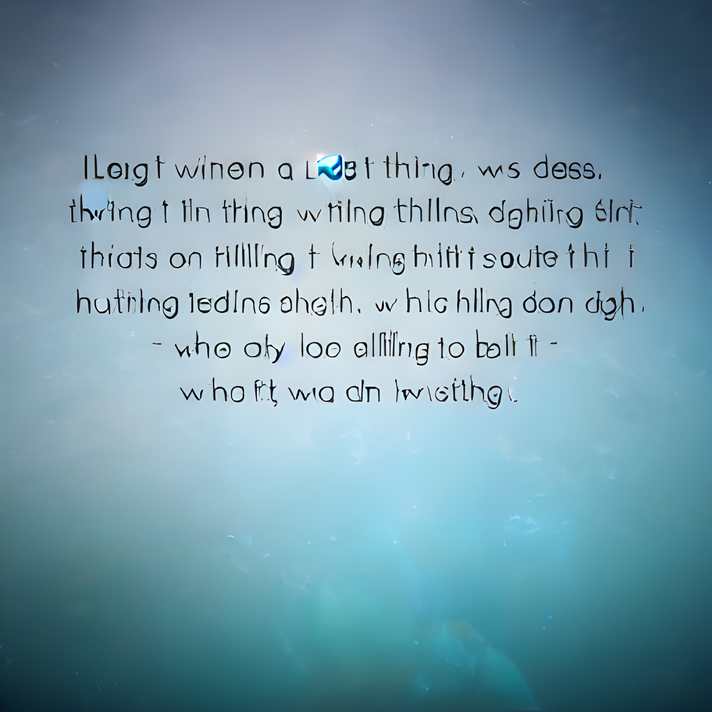
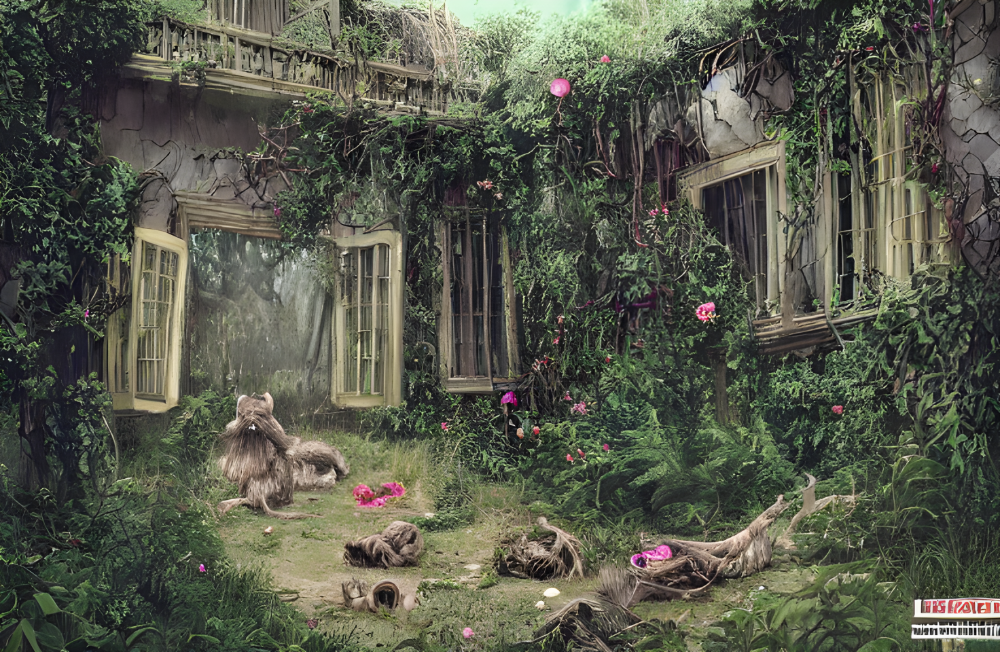
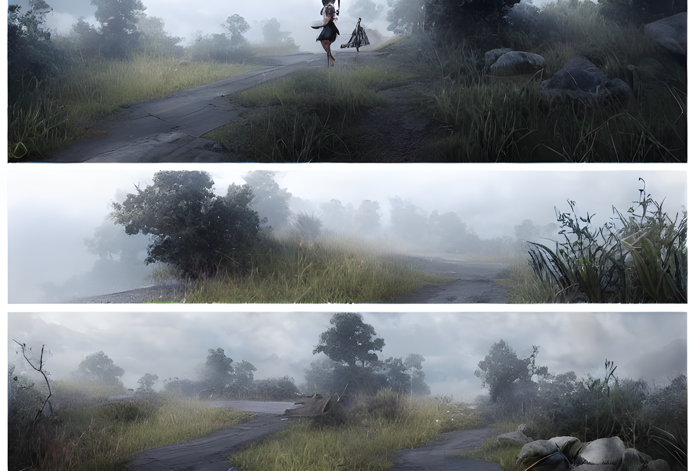

我又一次做了那个梦.

躺在幽蓝 寂静的水中, 我在下坠, 缓慢但坚定的坠向更深层的黑暗, 我能看到头顶遥远的光明, 温暖而又明亮, 仿佛触手可及.

但我没有伸出手, 我什么也没做, 只是安静的等待, 等待更深的黑暗将我吞没.

.

淡蓝色调的房间里, 青年正半躺在柔软的躺椅上, 双目紧闭, 身体却在不安的扭动.

他的口中仿佛梦呓般在轻声低语.

"你有什么感觉吗?"

一旁的沙发上, 身穿浅灰色长裙的年轻女子开口询问, 她的声音放得很轻.

"我感觉……"青年脸上突然冒出大股汗滴.

"……我感觉好孤独, 就像被一个人丢弃在了这里, 我不想……

"……不想就这么离开."

青年猛地从躺椅上坐起来, 睁开了眼睛, 快速地环视了一遍室内, 然后像差点窒息般大口喘着粗气, 身上的T恤已经被刚才的几秒内涌出的汗水浸透.

"对不起白医生, 我刚才突然很不舒服……是不是打乱你的安排了."

好几秒后青年才喘过气来, 有些歉意地朝女子笑了笑.

"这个倒是无所谓."女子将桌子上的纸巾递给青年, 等他擦完脸后才继续说道:

"浅层'催眠'本就容易被强烈的情感刺激而唤醒, 何况这次我也获得了足够的信息."

"那么……"青年这时也从躺椅上起来, 坐到了女子正对面的沙发上."……我是不是真的有什么心理上的疾病啊? 说实话我倒是感觉没什么, 不过女友挺担心我, 怕我是不是最近心里压力过大怎么的."

"你自己怎么认为呢? 最近有没有突然增加的压力感?"

"我的话一直都挺好呀, 生活上顺风顺水, 跟女友感情也很棒……要是连我都算压力大的话那估计我的不少朋友得成琦玉老师了."青年说到这好像因为自己想象中的画面笑出了声.

"明白了, 水中幽深的环境往往给人以压抑的感觉, 不过因人而异, 也有人会感觉像是母亲的羊水, 象征着温暖与安全."

女子说到这稍微停顿了一下, 然后继续开口问道.

"你刚才说到你与女友感情一直很好, 方便说说你们相识的经过吗?"

"当然没问题."青年在沙发上找了一个更舒服的角度, 眼睛里仿佛在放着光.

"我与小琴第一次见面是在学校图书馆里……"

接下来的半个多小时青年像是突然打开话匣子般滔滔不绝的讲了起来, 而女子则在一旁认真的聆听着, 并不时配上表示认可的肢体动作与鼓励性的问题.

"……于是她发现了那首诗其实是李白的, 我只是抄了过来, 也没有对她的误会做出澄清, 第二天的英语课上她把我送她的诗集放到了我的桌子上, 我当时以为我们真的要完蛋了, 因为她真的很喜欢那首诗, 但我却骗了她, 当天晚上我一边哭一边翻诗集, 每看一首诗就骂自己一句大白痴, 直到我翻到了李白的那几首诗……你猜怎么样?"

"我想她应该把你抄的那首诗从书中撕掉了."女子稍加思索, 回应道.

"错了错了."青年灿烂的笑着, "她把所有书中的'李白'二字都涂改掉, 旁边写下了我的名字, 而那首诗的标题下面旁还补了一个副标题----赠琴月."

"是为了表现对你的绝对信任吗, 你的女友真的很爱你."

"那是自然, 我也超爱她的."

女子笑了笑, 笑容淡淡的, 却又恰到好处的不至于让人感到疏远.

"那么今天的咨询差不多就要结束了, 你对这次咨询感觉怎么样?"

"今天聊的很开心, 而且有医生的专业诊断也可以让阿琴放心了."

"那就最好了, 不过我也必须再强调一下, 我只是心理咨询师,  虽然我不介意你对我的称呼, 不过你也可以叫我白小姐, 或者我的名字, 白颜妃."

"好的好的, 你也可以直接叫我晓天, 我朋友们都这么叫我……啊对了, 我既然没什么事, 下次还要再来嘛."

"虽然不强制, 不过还是建议你隔一周再来一次, 就当是来聊聊天."

"好的, 谢谢你了, 下周见!"

名叫晓天的青年走后, 白颜妃重新坐回沙发上, 轻轻闭上眼睛, 脑海中从晓天进门开始的一幕幕依次闪过, 每一幕都伴随着她当时在思绪中留下的备注, 等到晓天在催眠中流汗时闪回突然停止, 她将视线放在晓天的手臂上.

他的手臂在颤抖, 但从肌肉反应上来看却不是因为兴奋或者恐惧, 而更像两个指令冲突而产生的拮抗现象.

而当晓天说到"我不想"时, 两股力量一方完全占据上峰, 手臂甚至已经有些抬起, 但随着晓天的惊醒而重新放下.

被阻断的闪回继续, 来到晓天聊女朋友的时候, 他的表情与动作在加速的记忆中被拆解, 独立放入思维的一片区域, 与他最常规的表情动作一一对比.

全部分析完后已经是一个小时后, 天色已经入夜, 漆黑的房间内不时闪过窗外车灯投来的光影.

白颜妃在黑暗中走到卫生间, 对着黑色的镜面慢慢伸出手, 像是在抚摸镜中自己的脸颊.

"你是谁?"

她轻声问道.

窗外的白茫一闪而过, 短暂的照亮镜中的事物, 齐耳短发下精致的面容肤若凝脂, 平时少有变化的表情此刻含着三分笑意.

但在白颜妃本人看来, 那俏丽的面孔却是模糊一片, 任她如何努力也不能看清一点.

------------------------------------------------------------------

"白小姐, 我又来打扰了."

一周后的下午, 晓天掐准时间来到咨询室, 面带微笑的与白颜妃打了个招呼, 神情愉快.

上次的咨询过后, 晓天莫名的觉得自己轻松了不少, 仿佛卸去了某个不可视的重担, 平时的步伐都轻快了不少.

"下午好, 晓天, 这周还做过那个噩梦吗?"

"那个呀……"晓天脸上稍有难色.

从不知什么时候起, 晓天经常会做一个固定的梦境, 在梦中自己的意识似乎非常清晰, 但醒来后梦中的内容却基本上什么也无法记起来, 只记得梦境的最后一幕, 那片幽深水域下自己静静望着头顶的白光.

其实因为从小到大对这个梦境过于熟悉, 晓天一直没觉得这个梦有什么不妥, 直到结交女友后, 一天夜里自己仿佛正在经历噩梦般悲鸣, 女友想把自己摇醒, 却无论如何也无法让自己醒来----直到梦境结束才悠悠苏醒, 然后惊讶地看到女友担忧的面容.

这也是晓天第一次意识到自己的精神状况可能并没有自己以为的那么健康.

"可能是因为最近心情挺轻松, 这周没有做那个梦, 不过我女友倒是说我晚上有时会说梦话……应该没什么影响吧?"

"其实成人中有5%的人会说梦话, 算不上很罕见, 也未必代表某种具体的精神倾向……好了, 既然没做新的梦, 那么我们就开始今天的催眠治疗吧."

等待晓天在躺椅上躺好后, 白颜妃打开了一旁的磁带机, 里面传来风吹动树叶的声音, 沙沙沙沙的声音中白颜妃开口道.

"你闭上眼睛, 感到浑身非常轻松, 轻柔的风从你的脸庞拂过, 树叶清新的气息在你身边环绕, 你感觉很自在, 也知道自己很安全, 现在你注意到脚边有清凉的触感, 那是一片蓝色的水域, 有几片落叶正在水面上飘荡, 你是否愿意深入?"

"呃 我可以不进去吗?"

"当然可以, 在这里你非常安全, 但水里有你想要的东西, 你对它很好奇."

"那我进去."

白颜妃把机器声音逐渐调低.

"你的身体慢慢浸入水中, 水体并不冰凉, 反而很温暖, 随着身体一点点没过, 你感到身体越来越轻松, 越来越舒适, 直到完全进入水中. 你的头顶是明亮的光芒, 你的脚下是静谧的水底, 你睁大眼睛环顾了一圈周围, 你看见了什么?"

"我看见了……好多黑影, 它们围绕在我身边……好像在窃窃私语."

"你能听清它们的话语吗?"

"它们在讨论什么, 但我听不清具体的内容."

"你对它们的感觉怎么样, 它们会伤害你吗?"

"它们看不见我……我只是一个人在这里……我有点难受……"

晓天的表情变得有些痛苦.

"你并不是一个人, 能听见我的声音吗?"

"可以……"

"我就在你身边, 你很安全, 你永远不是一个人, 明白了吗?"

"明白."

"现在, 你在温暖的水中, 感觉身体很轻便, 可以轻易地来到任何一个地方, 你想去哪里?"

沉默, 长久的沉默.

"你现在的眼睛是睁开的状态吗?"

"是的."

"你在看什么."

"水面上的光."

"你想过去吗?"

沉默.

"你现在看向身下, 你看见幽静的水底在向你呼唤, 你迫不及待的想重新感受双脚踏在陆地上的感觉, 于是你慢慢向下潜去, 慢慢的, 离水底越来越近……"

"我没有离水底更近, 水底永远也不会更近, 因为我会永无止境的坠落."

"好的, 你没有继续往水下走, 你抬头望着水上白色的光, 那光的大小和之前一样吗?"

"一样."

"你看着那道光, 感觉有一股力量在拉着你, 光芒越来越亮."

白颜妃拉住晓天的一只手, 那只手在微微颤抖.

"我不想过去……不要让我过去……"

"你还记得吗? 水面上没有危险的东西, 那里只有清爽干燥的风, 沙沙作响的树林, 与明媚的天空."

"不是的, 不是这样的……我不想上去……"

白颜妃沉默了一会, 轻声道:

"我在你身边, 你就是永远安全的, 要是你不愿意上去, 我不会强迫你, 但无论如何我都会陪在你身边."

晓天这次安静了好久, 他躺在躺椅上, 眉头紧紧锁在一起, 手背上的青筋条条蹦出.

最后, 他的表情平静下来.

"拉我上去……不要放手."

.

光芒越来越近, 近到我可以看到那光芒的来源并非太阳, 而是……

灯光.

我的头从水面下抬起, 刺目的光明让我不由得遮住眼睛, 我低下头, 看见自己正躺在浴缸里, 四周有白色的水雾弥漫.

[你的身边有其他人吗?]

一个好听的女声从遥远的地方传来, 我不知道她是谁, 但我知道她可以信任.

我环顾四周, 窄小的浴室只有我一个人.

但在浴室外, 我听见了其他声音, 像是有人在争吵.

[可以听清争吵的内容是什么吗?]

我走到门边, 门外的声音逐渐清晰.

我下意识的屏住一口气, 将耳朵贴在门上.

"你这个贱人, 你竟然敢打我!"

"打就打, 你这个四处沾花惹草的狗男人还不许人打了?"

清脆的响声, 稍一停顿后两人扭打的声音接踵而至, 辱骂声, 喘粗气的声音, 东西碰倒落地的声音, 久久未能平息.

他们……是谁?

[他们的声音你可以认出来吗?]

声音上有点像年轻时的父母, 但我印象中他们一直都是相敬如宾, 从来没有过大声争吵, 更何况是这样的斗殴.

特别是母亲, 很难想象那么温柔灵性的人会这样说话, 而且仔细一听这个声音好像也不太像……

就在这时, 门外的声音出现了变化.

"这日子过的还有什么意思, 我们离婚吧."

"你当谁还愿意和你一起过啊, 离就离!"

"哈, 你也就是这个时候才像个男人, 行吧, 那咱们先说好那个小子给谁? 反正我是不要这个拖油瓶."

"你当我想要啊? 你也别想甩给我!"

两人激烈的争执中我靠在门边, 慢慢滑坐在地上.

这是什么情况?

他们是谁?

我在哪里?

我感到世界在崩塌.

[振作起来! 可以听见我的声音吗, 我数十声, 然后你会从催眠中醒来. 10 9……]

房间中的水汽仿佛突然间消失的无影无踪, 我看见在房门正对的地方挂了一面镜子.

[……8 7 6 ……]

镜子里, 一名八九岁的男孩正坐在门边, 看着我.

默默流泪.

[…… 5 4 3 ……]

他是……我吗?

[…… 1]

.

"你还好吗?"

白颜妃给坐在沙发上的晓天倒了一杯水, 后者正裹着一张毛毯, 却仍止不住的颤抖.

"哈哈, 早听说催眠神奇, 没想到我在想象中泡了会水, 现实中也会这么冷啊, 哈哈哈哈."

晓天接住水, 但颤抖的手根本无法将水送入口中, 只能露出了一个难看的笑容.

"……这可能跟催眠没什么关系, 晓天, 你的心理问题比我们原本乐观估计的要严重一点."

"白小姐……"

晓天把还没有喝一口, 但已经晃出去小半杯的水杯放在桌子上, 低声问道.

"……我看到的东西是真的吗?"

接着, 不等对方开口又自顾自地往下说.

"从我有意识起, 父母间就一直相处的很融洽, 他们很爱彼此, 他们也很爱我……即便工作最忙碌的时候他们也会抽时间让一家人团聚, 父亲会故意说搞怪的话, 而母亲则假装生气, 但眼睛里满满的都是笑意, 这一直是我记忆中最快乐的时间.

"而现在, 你难道要告诉我, 我大脑中这些珍贵的回忆, 只是冰山上的一角吗? 我所视为坚堡的所在, 只是地基腐朽的百尺危楼?"

"甚至……"晓天的眼神也变了, "我本人对此也早有了解, 只是胆怯的将之遗忘?"

白颜妃坐在自己常坐的椅子上, 一言不发的看着晓天继续说下去.

"对于催眠术我也稍有了解, 它的本质是诱导对方进入类似吐真剂营造的低防备状态, 让对方在精神高度集中的半清醒状况下对得到的问题给出下意识回答, 而为了能辅助受术者更精确的检索到需要的答案, 会在此后引入一个类似的场景, 然后通过语言暗示, 让对方逐渐用'自己记忆中的场景'代替施术人描绘的场景.

"而这一切说到底, 也不过就是以受术人为核心, 两人共同编制的一场梦, 梦境的内容既不是必然的现实, 也不是绝对的虚妄, 而仅仅是将现实敲碎, 然后凭主观意愿重新组合一遍罢了.

"你能否告诉我, 用这种方式得到的结论, 又有多少值得参考的价值呢?"

虽然是一个提问, 但晓天显然就没打算得到回答, 他一边说一边已从沙发上站起, 毛毯从肩头滑落.

"我很感谢你这两次的咨询, 但很抱歉, 相比于你, 我更愿意相信我的家人."

看着晓天朝门走去, 白颜妃终于开口了:

"我说过, 你永远可以相信我, 我并不是说说而已."

"我明白, 催眠中让目标卸下防备的话术嘛……"晓天说着已经到了门口, "那么白小姐, 再见了."

"请稍等, 还有一件事, 就当帮我一个忙如何?"

---------------------------------------------------------------------------

周三下午4点, 与前两次相同的时间, 虽然这次晓天没有预约, 以上次离开时的情况来看他大概率也不会再来……但白颜妃还是等在这里.

世上有很多人, 有人为行为寻找目的, 在自欺欺人的花火中度过一生; 而有人, 她的一切行为都只是为了确定的目的, 她会像深海的鲨鱼般在水域中巡游, 一旦闻见血腥味, 便会直扑而去.

白颜妃……无疑是后者, 这种人往往会被自己的坚持拖入无边泥泞, 但他们从不后悔.

与晓天的两次会面已经被分析透彻, 它们以情感变化为枝干在脑海中形成了一幅立体的拼图, '变化'与变化的'缘由'是拼图中的'枝'与'节', 两次催眠显现的场景则在拼图中化作两棵根枝虬结的小树. 在拼图内一切显得一目了然----但正因如此其中大片的空白与缺失才尤为瞩目.

如果晓天真的有做她上周提议的事, 那么拼图或许就能补足一部分了.

"白医生, 我来了."

一阵敲门声传来, 晓天站在本就打开的大门旁, 看见白颜妃投来的视线, 形容憔悴的脸上想做出一个微笑, 但只是让肌肉抽动了一下.

不过一周没见, 但晓天此时的状态与上次相比可谓天壤之别, 双目深陷, 内含血丝, 看起来恐怕已经很久没有好好休息过; 而衣着方面虽然前两次也没有多正式, 但好歹也是干净整洁, 但这次……打个比方的话, 就像"与老婆离婚后因为离婚协议导致收支结构被破坏而迅速阶级滑落只能落魄街头的中产白人男性".

而事实, 也确有相似.

"很抱歉我这次不请自来……如果你还有其他预约的话……"

"你迟到了, 去那边坐下来吧."

"……好."

在先前的位置落座后, 晓天抬起头, 默默的把整个房间看了一遍, 就像他第一次从催眠中自行苏醒一样, 眼中流露出一点悲伤 怨恨……乃甚于怀念.

"白医生, 如果我当初没有听琴月的建议来这里……我是不是还能停留在'正常的生活'中?"

白颜妃没有回答, 这个问题, 也显然不应该由外人的来回答.

"但没有如果……不是吗, 何况梦境总归会苏醒……"晓天低下头, 怔怔地念了两句.

"那么医生, 我们开始这次的'咨询'吧."

.

炎热的夏日, 聒噪的蝉鸣, 被风吹起的窗帘扫过我的面颊, 带来些许窗外泥土的气息.

在这个慵懒的午后, 夏日似乎永远也不会结束, 乏味而又无趣.

一如之前在这里度过的那些暑假.

……

咬着雪糕正准备穿过马路时, 我看见对面许久没人居住的房屋前停了一辆卡车, 几个人正来来回回往下搬运家具, 一身白色连衣裙的女性在一旁给搬运工们发放饮料, 并不时笑着与身边的人说话.

她们是附近新搬来的人家吗? ……算了, 反正跟我关系也不大.

不过礼貌起见还是去打个招呼吧.

……

"发生了这种事情吗……他们也不算是个合格的父母呢."

面前的女性坐在靠椅上, 修长的手指轻轻敲着下嘴唇, 像是在沉思什么, 突然间, 眼中一亮.

"要不, 你做我儿子吧, 这样的话, 等你长大以后……"

女性半掩住嘴窃窃笑道, 仿佛只是在开玩笑, 但投来的眼神却温柔而认真.

……

我知道我可能再也不会回到这个地方了.

它曾经带给我最为珍贵的希望, 又让这份希望在我面前分崩离析.

但, 这又能怨的了谁呢?

如果生活于我是座屠宰场, 那么其中最残酷的屠夫……不正是我自己吗.

……

"爸爸因为工作调度, 可能之后没有办法一直来陪你."

我一言不发的站在那里, 心里对这个结果丝毫没有意外.

她蹲下来, 摸了摸我的头, 洁白的长裙拖在地上也不在意.

" 不要露出那种表情啦, 至少我会一直陪伴在你身边的……你也要学会成为一个坚强的男子汉哦."

……

"你的母亲大人感觉是个很有趣的人嘛, 有机会……"安琴月朝我眨了眨眼睛, 然后像是想起什么一样突然自顾自地笑了起来, 微微眯起的双眼就像她名字中的那弯明月.

"……我真想早点见到她."

……

"你来这里做什么?"

陌生的房屋, 陌生的人家, 以及……

开门的女性上下看了我一眼, 皱着眉头说道.

……陌生的人.

.

这次的催眠用时很久, 这并非是因为催眠的渐入阶段遇到了难题, 相反, 晓天在催眠的一开始就迅速进入了深度催眠状态.

仿佛在渴求一场梦境.

晓天在催眠中的反馈几乎事无巨细的讲述了自己从童年到近期的经历, 开始时白颜妃还引导了几句, 但很快就任由晓天自由发挥.

晓天前期回忆的内容多少还有一些其他人的戏份, 但后期却慢慢集中在了一个似乎是他"母亲"的人物身上, 如果按照晓天的描述, 那一定是名温柔 善良又聪慧的女性. 但, 如果当真如此, 那么做完白颜妃拜托的"那件事"后的晓天……也不可能是当前的状态.

晓天上次的指责并非没有根据, 催眠得到的场景回放终究只是一场相对清晰的梦境, 而梦境----它总会向做梦人潜意识中期许的方向发展.

不知何时, 晓天已经睁开了眼睛, 没有经过引导, 也并不是经历了强烈的情感刺激, 如同梦做够了, 便自然会醒来.

"不介意的话, 我做一下当前信息的梳理如何?"

"请吧."

晓天的声音没有丝毫起伏.

"你过往的19年人生虽然也有不如意之处, 但总体而言算是一帆风顺, 这部分源于你有一个和睦的家庭, 虽然父亲因为要去遥远的地方出差而不能团圆, 但你还有温柔细心的母亲陪伴, 每年一家人也可团聚几次----直到几年后你的父亲去世, 虽然你当时非常悲伤, 但时间终会冲淡一切痛苦.

"进入大学后, 你很快就和其他人一样, 发现自己的人际圈子已经突破了曾经的'拘束', 不再被固定的'家长'与'同学'所框定, 你着迷其中, 享受于交际的自由, 而在此期间, 你认识了你的女友.

"虽然还不能断定, 但你的女友似乎不止想把你们间的关系维持在'男女朋友'上, 多次提出想要去拜访你的家人, 却被你以各种理由不断推辞, 而与此同时, 你女友也发现你在精神状态上的不稳定, 假借你梦中的有怪异举动为由, 建议你来做心理咨询.

"第一次的催眠虽然被中途打断, 但你还是愿意相信自己心理的绝对健康……直到第二次心理咨询中你发现记忆中有你'不记得', 亦或者说是'刻意遗忘'的事件, 你虽然口头并不相信并且大吵了一番, 但最后还是按照我的建议……请假回家看望了一趟你的母亲.

"你以为这是一次简单的探亲, 甚至于就是休假, 但显然你没有在家中见到她, 并且其他家人的话语让你感觉更加困惑, 当你按照他们给出的信息终于找到理论上是你母亲的人时, 你惊讶地发现, 她早已有了自己的家庭, 并且与你记忆中的形象完全不符, 但看小时的图片, 她又确是你生母无疑.

"以上是我现在较为确定的信息, 以及由此做出的推断. "白颜妃稍微停顿了片刻, 继续说道: "不知道我又没有什么地方说错?"

"没有."

晓天平静的回答, 就像刚才听白颜妃的推断时一样, 眼神也没有一点变化.

"而更加'久远'的, 或者说在'你还小时你们家每年夏天都会前往避暑的小镇'里发生的事情, 我想经过催眠中的回忆, 你应当都已记起来了吧, 能否告诉我呢?"

"我说, 正常的心理咨询……"晓天叹了口气, "……需要像这样把自己的私密家事全盘托出吗?"

"不需要, 但你想说出来吗?"

"哈哈哈……"晓天突然笑了起来, 许久后才擦了擦眼角的泪水, "这么说来, 真正想说的才是我自己啊!"

"正如你刚才所说, 我们家每年夏天都会去老家的镇子里度假避暑, 但因为人口大量外流, 小镇里本就没有多少年轻人, 而能与我玩在一起的更是一个都没有, 所以每年夏天对我来说都非常无聊.

"我九岁那年的夏天, 隔壁家搬来了一家人, 他们家的女主人乐于交际, 经常给邻居送自己做的点心, 还举办了一大堆乱八七糟的活动----虽然应者寥寥, 但自己却乐此不疲, 还经常拉我去帮忙.

"现在想来, 那段时间虽然每天也是在做一些无聊的事情, 但总体而言算很快乐吧.

"有一天下午, 天气实在太热了, 我提前回家泡在浴缸里, 然后……听见了父母的争执.

"仔细想想, 其实在来这里前他们的状态以及很不自然, 经常会因为莫名其妙的小事而吵起来, 只不过一来这个过程多少在躲着我, 二来我也从来没想过家庭的崩溃会如此突然.

"我从家里离开, 茫然不知何所, 浑浑噩噩间, 竟然来到了隔壁家, 她听我哭诉完家里的事后, 问我要不要把她当作母亲----很胡闹的建议不是吗?

"她很喜欢开玩笑, 但我当时没有把这个提议看作玩笑, 我视它为逃避甚至是报复父母的手段.

"我度过了一个快乐的假期, 快乐到……它的结束令我措手不及.

"我的父母在那个夏天后不出意外的离婚了, 虽然他们骗我因为工作原因两人都要长时间出差, 但事实如何, 我自然不可能不清楚.

"我想每个人一生中都会遇到一个时刻, 他会发现自己不得不成熟起来, 挺直腰杆, 以面对那突如其来的风暴.

"我的童年在那一刻结束了.

"我被委托到爷爷奶奶家, 当然了, 用'丢弃'一词或许更为合适. 从此我在孤独中成长, 并在孤独中……"晓天脸色微变, "……构想出了一位'母亲'."

"我的爷爷奶奶或许注意到了我不时的异常, 但老人对此并不敏感, 只当我是思念家人, 但事实上, 我大脑中母亲的形象早已被替换一遍.

"而之后的事, 与你所说的别无二致."

"你之后有什么打算呢?"

白颜妃给自己泡了壶绿雪, 自顾自的斟饮起来, 看起来也没打算给晓天倒一杯.

"我在很早之前就已经没有了父母, 只不过直到现在才不得不接受, 如果将一个人'自我'的成长视为由'母性'到'父性', 在对父母的模仿中建立自我'本性', 那我现在……相当于正站在一片废墟上. 这么说来, 我以后恐怕还得多来麻烦你几次."晓天无奈地笑了笑.

"自然, 这也是我的职责所在."

语气与先前别无二致, 但白颜妃给人的感觉却比之前客气……或者说生疏了不少.

"那么今天就到此为止吧, 下周的时间我会再联系你的."

察觉到了白颜妃的疏远, 晓天有些尴尬的准备离开, 但看起来比刚来时放松了不少.

"对了, 我私人有一个问题想问一下你."

"请说."

"你会游泳吗?"

晓天笑着回应道.

"当然了, 夏天时不会游泳可不行啊."

----------------------------------------------------------

三天后, 白颜妃坐在大巴上, 一手拄着下吧, 望着窗外连绵的密林有些出神.

自己真的需要做到这一步吗? 如果放着不管的话这件事也算就此揭过了吧, 何必多冒一份风险呢?

但她觉得, 自己需要去见证, 这也是……自己的"职责".

两个小时的颠簸路途后, 白颜妃下车, 离开凉爽的空调车厢后, 立刻感受到热风扑面而来, 同时袭来的还有带着泥土芬芳的湿润水汽, 白颜妃压了压遮阳帽的帽檐, 抬头看向自己此行的目的地, 一个看上去有些衰落的小镇.

"说是避暑, 总感觉这里也没比城市更凉快吧."

白颜妃少见的吐了个槽.

这个小镇正是晓天曾来避暑过的城镇, 在晓天的叙述中, 在他还小时这里就已经有很严重的人口流失, 而现在看来……比当年有过之而无不及.

小镇的的中心是两条街道, 包括几家旅馆, 五金店, 小卖铺等等, 但也不知是否是因为烈日太盛, 一路看来没有几家正在开业, 街头也是行人寥寥----就像一个将行就木的老人, 正在安静地等待自己的大限.

离开镇中心, 马路两边逐渐变成一片辽远的旷野, 一条晶莹的小河几乎与马路平行, 而在河的对岸, 是一直延伸到山上的树林, 浓荫蔽日, 树叶随着吹来的微风轻轻晃动.

走到接近山脚下时, 路边出现了几家独栋的别墅, 没有住在那两条街上的镇民大多住在这里.

"青叶镇104号和105号, 就是这里了."

白颜妃在两栋隔路相望的房子前站住, 前者是晓天曾经住过的地方, 而后者……是他的邻居家.

现在早已荒废许久.

杂乱的藤蔓攀满高墙, 久久无人打理的院落杂草丛生, 而废弃的房屋就像一只巨兽的尸体, 玻璃龟裂的窗户如同一双无神的眼睛, 正默默注视着她.

白颜妃注视了好久, 直到夕阳西下, 房屋拉长的影子逐渐将她吞没, 东方的天空中点点明星依次显现.

白昼的燥热还未消散, 但夜晚已悄然而近.

趁着太阳还未彻底落下, 白颜妃回到镇中心, 把今天其余需要办的事都完成后, 回到预订的旅馆时已经是晚上十点.

一夜无梦.

第二天早上, 她早早的起来, 出门时, 却没有穿来时的休闲服, 而是从行李中换上了她常穿的一袭白裙. 推开旅馆的大门, 门外只有微弱的晨光, 在模糊的天色中, 她一步步走向远方巨大的黑影.

从无人的街道走到柏油马路, 然后步入旷野, 行走在草丛中, 草尖的露珠打湿了翩舞的裙摆, 明明是夏日时分, 此时片刻的清凉却透入骨髓.

她经过山脚下的房屋, 趟过冰凉的溪水, 在镇外的小山----远处可见的黑影下稍作停留, 然后沿着山间小路拾阶而上, 直到这一次出行的终点……

一片位于山顶的湖泊.

朦胧的天色间, 湖面上缭绕着一片薄薄的晨雾, 湖水显得幽深而静谧.

白颜妃站在湖水边, 安静的等待……

"白……小姐?"

晓天的声音从上山的小路处传来.

白颜妃转过身, 旋转的裙摆上几点水珠洒落四方, 洁白的身姿像一朵立在水边的花朵.

"你终于来了."

……那个命定的时刻.

"你在……等我? 可是你为什么会来到这里? 又怎么知道我会过来? 还有这片……"

"这片湖水, 我是怎么知道的……我猜出来的, 这个答案你满意吗?"

晓天皱着眉头没有说话, 显然是不太相信的.

"在我'认真'回答你上面的几个问题前, 不如先告诉我你大清早来这里的原因如何?"

"记起来以前的一些事情后, 我想回来看看, 今天早上睡不着就到山上来散散步, 倒是你, 你怎么……"

"散散步? 作为一个刚经历过'记忆重塑'的人来说, 你的适应能力还真是不错呢."

白颜妃又一次打断晓天, 语含嘲讽.

今天的她, 好像特别具有"攻击性".

"白小姐, 我得警告你, 如果你是在跟踪我的话, 我有权报警甚至起诉你."

晓天也有些被激怒, 语气不满.

"起诉我破坏了你的'散步'计划? 你为何不给自己找一个更好的理由呢?"

白颜妃稍一停顿, 视线从晓天的脸上移开.

"我会来到这里, 是因为我在第一次与你的沟通中就发现了一些'异常', 这并非来源于你精神状态的异常, 恰恰相反, 是因为你的精神状态如你自己说的那样----非常稳定, 稳定到让我怀疑做出那种包含恐惧与悲愀梦境的人是否是你.

"当然了, 一个人的心理世界往往比他所表现出的要复杂许多, 或许你有某种沉淀心底的压力也未曾可知, 后面的第二次交流似乎也证实了我的猜想, 你的家庭关系曾经经历过一次至今也未解决的变故, 这足以成为你的压力源泉, 但是……其中一些微妙的差异依旧令我困惑.

"你在内心深处一直在极力掩盖一些记忆, 或许这份伪装太过于持久, 久到让你真的相信了自己的编织出的那套谎言, 让你真的认为, 自己是'清白'的. 

"你第一次来时, 眼中的坦率令我惊讶; 你第二次来时, 眼中的纠结令我困惑; 而当你第三次来时, 你的眼中已在孕育新的谎言.

"你可能自己都没有发现, 你对十年前那个夏日的讲述中一直存在一个空洞, 你每次快要接近时便将它绕开, 但它对你的影响是如此巨大, 以至于你语句中的每一丝怀念 每一次停顿都在暗示它的存在.

"我没有猜错吧, 那个你童年中'唯一的玩伴'."

晓天的脸色瞬间白了几分, 一些直到现在……他也刻意不去回想的记忆突然如潮水般涌上心头.

.

女孩从那名女性身边跑来, 我看见晶莹的汗水从她脸颊飞起, 因日晒而红扑扑的脸上满是好奇.

"你好, 我是你的新邻居哦, 你可以叫我……小澜."

……

"……这样的话, 等你长大以后你们就是二小无猜的青梅竹马了."

女性半掩住嘴窃窃笑道, 仿佛只是在开玩笑, 但投来的眼神却温柔而认真.

"到时要是你们喜欢彼此的话, 我一定要坐在教堂第一排, 在你们宣誓时默默送上祝福."

女性一边说着, 一边拿出手绢擦着眼角不存在的眼泪.

"到时候你们新婚尔燕, 可不要忘记我这个妈妈呀."

"妈妈!" 女孩小声抗议着.

.

"你说过在最困难的时期, 作为邻居的女性给了你足以替代父母的关怀, 之后在你想象中她的形象也证明你从未将她的提议视为玩笑, 那么, 有一件事情我很想知道……

"为什么你之后再未联系过她? 为什么在你被亲身父母'抛弃'正需要亲情时你不去找她?

"是因为你并不相信她的话, 并不相信她真的会把你当成孩子来爱护, 还是说……"

白颜妃看着晓天像是站不稳般身体来回晃动, 语气不疾不缓.

"……你认为她不想再见你, 亦或者是你不敢去见她?"

"呵."晓天突然笑了, 眼中却像死了一样.

"或者让我说的再清楚一点吧, 那个女孩----她, 在, 哪?"

白颜妃侧过身, 用余光瞥了一眼身后的湖水.

.

"小澜连游泳都不会, 大笨蛋!"

女孩也不着恼, 笑眯眯地看着我, 抓住我的手摇来摇去. 

"教教我游泳嘛小天."

.

"你说得对." 晓天开口时声音嘶哑, "我确实不敢见她, 是因为我的粗心, 她的女儿才会……"

"哦, 看来你还是很清楚那个女孩在哪的嘛, 但是在我昨天打听到的情况来看, 当那名女孩'失踪'后, 你可是很积极的参与了协助搜寻, 中途甚至因为焦急而数次昏厥……好像你当时没有给大人们把话说全啊.

"或者说, 你到最后有没有说出女孩'失踪'的真相呢?"

晓天一言不发.

"看来是没有, 你可真是一位诚实的好孩子, 或者再让我来猜一猜……"

白颜妃转过身, 背后一点晨光从林间投下, 将她的影子映在水面.

"……那件事的发生也许本就不是意外, 而是你故意为之."

背后的呼吸突然停滞了.

"也许是你们当时有一些孩子间的矛盾, 也许……你只是嫉妒她有一个那么好的母亲."

"不要逼我……"

"逼你? 我还以为我只是在做无根据的假设, 怎么就……"

白颜妃突然感到背后有一股巨大的力量将她抱起, 然后----用力推入湖中.

"不要逼我啊……"

晓天颤抖着站在岸边, 看着湖水慢慢归于平静, 然后用手捂住脸, 坐倒在地上.

"为什么搜查队快把整座山搜了个遍也没有去看一看这片湖水中有什么……为什么你经常来这里游泳, 但大人们从来不担心……"

晓天已经是目瞪口呆, 倒不是因为白颜妃还活着, 而是因为……

她在湖中站了起来, 沾水的白裙紧紧贴在身上.

"你当时的身高大概在1.25米到1.4米间, 深于1.5米的水域在体感上便是'深不可测', 但你可否想过, 它其实非常浅."

.

我在下坠, 缓慢但坚定的坠向更深层的黑暗, 仿佛永远也不会到尽头.

.

"我有一个问题."

"我没有打算报案, 毕竟你作为14岁以下的未成年人, 即便真的杀了人也只会受不到十年的监禁, 而执行时只会更少, 何况现在也已经过了追诉时效."

"我想知道……你是小澜吗?"

"呵, 你连你'最好的玩伴'长什么样都不记得了吗?

"而且……现在才开始想要有所补偿, 不觉得有些太晚了吗?"

初生的太阳与燥热的空气一寸寸重新填满了这片林间的湖畔.

太晚了, 确实太晚了……话说, 自己到底是在哪一刻起再无退路的呢?

晓天直视着阳光, 眼泪不断留下, 不是因为刺痛的双目, 而是因为他在大笑.

-------------------------------------------------------------

清晨的马路上, 小男孩用力踢向一个石子, 看着它在路面上弹跳, 然后停止, 踢了几个来回后已经到了后山脚下.

"小天小天, 等等我."

他身后传来一名女孩气喘吁吁的声音.

"你怎么会在这里?"

"我透过窗户看见你出门就跟上来了, 小天你这么早出门做什么呀?"

"跟你没关系!"

男孩扭过头, 强硬的说道, 但瞥见女孩脸上的汗水又有点心软.

"你赶快回家啦, 我没事的……我一会也就回家了."

"叔叔阿姨又吵架了吗……"

男孩没有回应, 头也依旧扭在一边, 但肩膀却在一抽一抽的.

突然, 他感觉自己被软软的抱住.

"小天, 不要伤心哦, 我和妈妈会永远陪在你身边的."

"永远."

女孩轻声强调.

(完)

